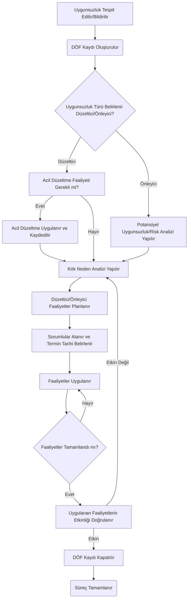
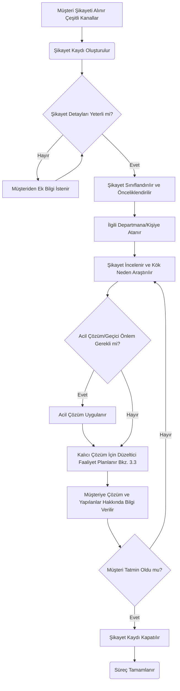
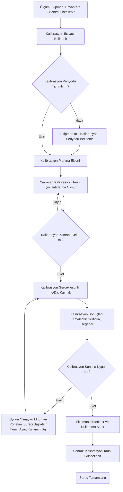
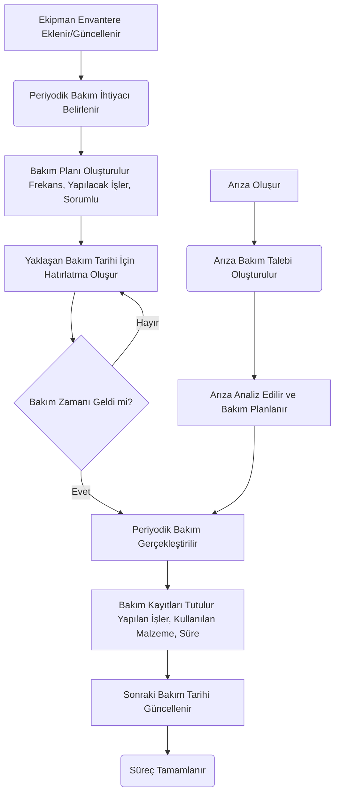
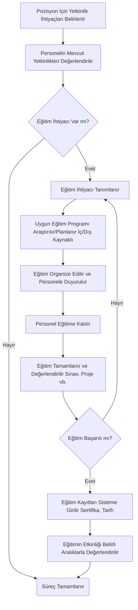
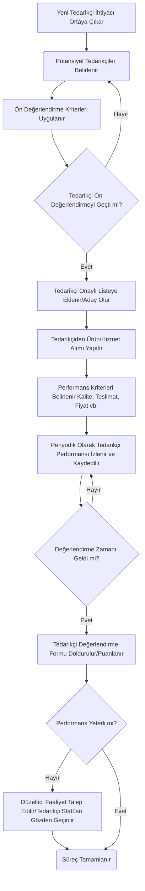
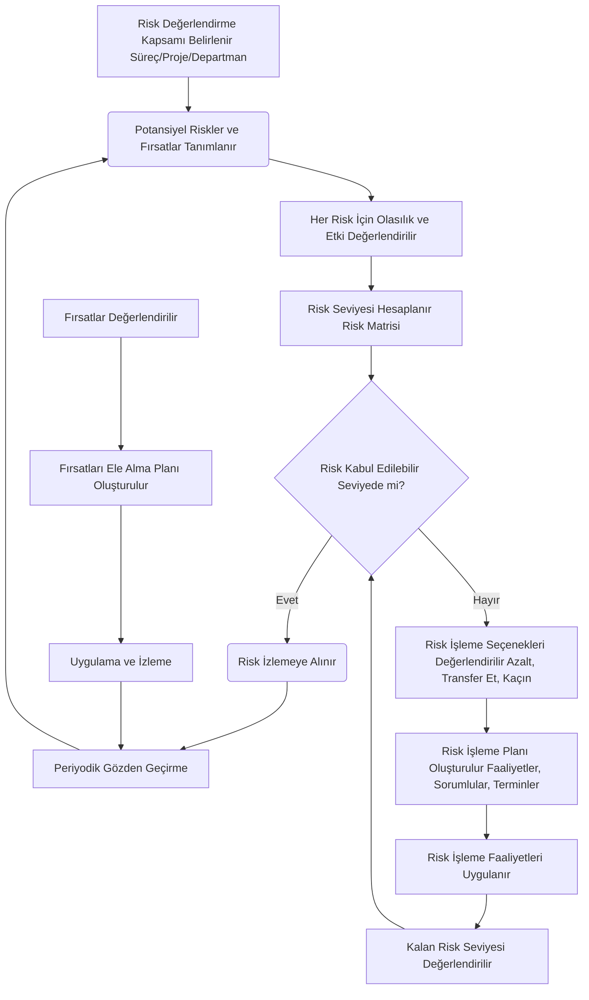
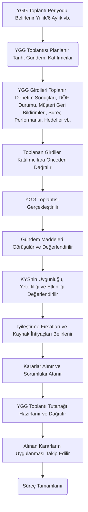

### 2.12. Bildirimler ve Görev Yönetimi

*   **2.12.1. Amaç ve Kapsam:**
    *   Bu modülün amacı, KYS içindeki çeşitli süreçlerle ilgili olarak kullanıcılara zamanında ve ilgili bildirimler (hatırlatıcılar, uyarılar, bilgi mesajları) göndermek ve kullanıcılara atanan görevlerin (aksiyonlar, sorumluluklar) merkezi bir yerden takip edilmesini sağlamaktır. Kapsam, tüm KYS modüllerinden kaynaklanabilecek bildirimleri ve görev atamalarını içerir.

*   **2.12.2. Temel Özellikler ve Fonksiyonlar (Kullanıcı Senaryoları ve Görev Tanımları ile):**
    *   **Kullanıcı Bazlı Bildirimler:**
        *   *Senaryo 1:* Bir doküman, onay için bir yöneticiye gönderildiğinde, yöneticiye sistem üzerinden bir bildirim ulaşır.
        *   *Görev Tanımı (Sistem/Yönetici):* Doküman Yönetimi modülü, onay akışında bir sonraki adıma geçildiğinde, ilgili yöneticiye "Onayınızı Bekleyen Doküman: [Doküman Adı]" şeklinde bir bildirim (e-posta, sistem içi mesaj) gönderir. Yönetici, bildirime tıklayarak doğrudan ilgili dokümana erişebilir.
        *   *Fonksiyon:* Kullanıcılara, kendileriyle doğrudan ilgili olaylar hakkında (örn: yeni DÖF ataması, onay bekleyen doküman, eğitim daveti, denetim görevi, YGG aksiyonu) anlık veya periyodik bildirimler gönderme. Bildirimlerin e-posta, sistem içi mesajlaşma veya mobil uygulama (varsa) üzerinden iletilmesi.
    *   **Otomatik Hatırlatıcılar:**
        *   *Senaryo 2:* Bir ölçüm cihazının kalibrasyon tarihi bir hafta sonra dolacaktır. Sistem, sorumlu kalite teknisyenine bir hatırlatma bildirimi gönderir.
        *   *Görev Tanımı (Sistem/Kalite Teknisyeni):* Ekipman Yönetimi modülü, yaklaşan kalibrasyon tarihlerini (örn: 7 gün, 3 gün, 1 gün kala) kontrol eder ve sorumlu kişiye "Yaklaşan Kalibrasyon: [Ekipman Adı] - Tarih: [Tarih]" şeklinde bir hatırlatma gönderir.
        *   *Fonksiyon:* Kullanıcılara veya sorumlu gruplara, yaklaşan termin tarihleri (DÖF faaliyetleri, denetim tamamlanma, doküman gözden geçirme, kalibrasyon/bakım tarihleri, eğitim son kayıt tarihi vb.) hakkında otomatik hatırlatıcılar gönderme. Hatırlatma sıklığının (örn: X gün kala, her gün) yapılandırılabilmesi.
    *   **Görev Listesi (To-Do List):**
        *   *Senaryo 3:* Bir departman yöneticisi, kendisine farklı modüllerden (DÖF, İç Denetim, YGG) atanmış tüm açık görevleri ve bunların termin tarihlerini tek bir ekranda görmek ister.
        *   *Görev Tanımı (Departman Yöneticisi):* Sistemdeki kişisel "Görevlerim" veya "Yapılacaklar Listesi" bölümüne girer. Bu ekranda, kendisine atanmış tüm görevler (örn: DÖF faaliyeti tamamlama, denetim bulgusuna cevap verme, YGG aksiyonunu yerine getirme), görevlerin kaynaklandığı modül, önceliği, termin tarihi ve mevcut durumu listelenir. Görevleri önceliğe veya termine göre sıralayabilir.
        *   *Fonksiyon:* Her kullanıcının kendisine farklı KYS modüllerinden atanmış olan tüm açık görevleri, sorumlulukları ve aksiyon maddelerini birleşik bir arayüzde (kişisel görev listesi/dashboard) görüntüleyebilmesi. Görevlerin kaynağı, tanımı, atayan kişi, atanma tarihi, termin tarihi, önceliği ve mevcut durumu (açık, devam ediyor, tamamlandı, gecikti) gibi bilgilerin gösterilmesi. Görevleri filtreleme ve sıralama özellikleri.
    *   **Görev Atama ve Takip:**
        *   *Senaryo 4:* Bir DÖF kaydında, kök neden analizi sonucunda bir faaliyet planlanır ve bu faaliyet bir mühendise atanır.
        *   *Görev Tanımı (Kalite Uzmanı/Mühendis):* Kalite uzmanı, DÖF modülünde faaliyeti tanımlarken sorumlu olarak ilgili mühendisi seçer ve bir termin tarihi belirler. Sistem, bu faaliyeti mühendisin görev listesine ekler ve bir bildirim gönderir. Mühendis, görevi tamamladığında sistem üzerinden durumu günceller.
        *   *Fonksiyon:* Farklı modüller içinde (DÖF, Denetim, YGG, Proje Yönetimi vb.) tanımlanan aksiyonların, faaliyetlerin veya sorumlulukların belirli kullanıcılara veya kullanıcı gruplarına görev olarak atanabilmesi. Atanan görevlerin ilerleme durumunun takip edilebilmesi. Görevlerin yeniden atanması veya termin tarihlerinin güncellenmesi.
    *   **Bildirim ve Görev Ayarları (Kullanıcı Tercihleri):**
        *   *Senaryo 5:* Bir kullanıcı, belirli türdeki bildirimleri (örn: sadece yüksek öncelikli görev atamaları) e-posta ile almak, diğerlerini ise sadece sistem içinde görmek ister.
        *   *Görev Tanımı (Kullanıcı):* Kişisel ayarlar bölümünden bildirim tercihlerini (hangi tür bildirimler, hangi kanaldan - e-posta/sistem içi, hangi sıklıkta) yapılandırabilir.
        *   *Fonksiyon:* Kullanıcıların hangi tür bildirimleri, hangi kanallardan (e-posta, sistem içi, mobil) ve ne sıklıkta almak istediklerine dair kişisel tercihlerini ayarlayabilmesi (yapılandırılabilirse).

*   **2.12.3. Süreç Akış Diyagramı Referansı:**
    *   (Bu modül genellikle diğer süreçlerin bir parçası olarak işler, kendi başına karmaşık bir akıştan ziyade bir destek fonksiyonudur. Ancak "Görev Atama ve Tamamlama Akışı" gibi bir alt süreç tanımlanabilir.)

*   **2.12.4. Veri Gereksinimleri:**
    *   **Girişler:** Bildirim tetikleyici olaylar (örn: yeni görev, onay talebi, termin yaklaşması), görev tanımları, sorumlu kullanıcılar, termin tarihleri, bildirim metinleri, kullanıcı tercihleri.
    *   **Çıkışlar:** Gönderilen bildirim logları, kullanıcıların görev listeleri, görev durumları, geciken görev raporları.
    *   **Önemli Alanlar:** `notification_type`, `user_id` (recipient), `message_content`, `task_description`, `assigned_to_user_id`, `due_date`, `status` (task status), `source_module`, `source_record_id`.

*   **2.12.5. Diğer Modüllerle Entegrasyon Noktaları:**
    *   **Tüm KYS Modülleri:** Bu modül, diğer tüm KYS modüllerinden gelen olaylara (yeni kayıt, durum değişikliği, onay ihtiyacı, termin yaklaşması vb.) göre bildirimler üretir ve görevler oluşturur/takip eder. Entegrasyon, KYS genelinde iş akışlarının ve sorumlulukların etkin yönetimi için kritiktir.

*   **2.12.6. Yapay Zeka (AI) Asistanı Entegrasyon Senaryoları:**
    *   **Akıllı Önceliklendirme:** Kullanıcının görev listesindeki görevleri, termin tarihleri, görevin kaynağı (örn: kritik bir denetim bulgusu) ve kullanıcının geçmişteki görev tamamlama örüntülerini analiz ederek akıllı bir şekilde önceliklendirme önerileri sunma.
    *   **Görev Tamamlama Süresi Tahmini:** Benzer görevlerin geçmişte ne kadar sürede tamamlandığına bakarak yeni atanan bir görev için tahmini tamamlanma süresi önerme.
    *   **Bildirim Yoğunluğu Yönetimi:** Kullanıcının aldığı bildirim sayısını ve türlerini analiz ederek, daha az rahatsız edici ama etkili bir bildirim özeti veya zamanlaması önerme.

*   **2.12.7. Çevrimdışı (Offline) Çalışma Gereksinimleri:**
    *   Kullanıcıların kendilerine atanmış görev listesini (temel bilgilerle: görev adı, termin) çevrimdışı olarak görüntüleyebilmesi.
    *   Çevrimdışı modda basit görev durumu güncellemeleri (örn: "Başlandı", "Tamamlandı" gibi işaretlemeler) yapabilme ve bağlantı kurulduğunda senkronize etme.
    *   Son alınan bildirimlerin bir kısmının çevrimdışı okunabilmesi (önbellekleme ile).

### 2.13. Raporlama ve Analiz

*   **2.13.1. Amaç ve Kapsam:**
    *   Bu modülün amacı, KYS uygulamalarından elde edilen verileri toplayarak, analiz ederek ve anlamlı bilgilere dönüştürerek Kalite Yönetim Sistemi performansının izlenmesini, değerlendirilmesini ve karar verme süreçlerinin desteklenmesini sağlamaktır. Kapsam, tüm KYS modüllerinden gelen verileri, standart raporları, özelleştirilebilir raporları, performans göstergelerini (KPI) ve analitik gösterge tablolarını (dashboard) içerir.

*   **2.13.2. Temel Özellikler ve Fonksiyonlar (Kullanıcı Senaryoları ve Görev Tanımları ile):**
    *   **Standart Modül Bazlı Raporlar:**
        *   *Senaryo 1:* Kalite yöneticisi, son çeyrekte açılan ve kapatılan DÖF sayısını, ortalama kapatma süresini ve en sık karşılaşılan uygunsuzluk kaynaklarını görmek ister.
        *   *Görev Tanımı (Kalite Yöneticisi):* Raporlama modülünden "DÖF Raporları" bölümüne girer. "Çeyreklik DÖF Analizi" gibi standart bir raporu seçer, ilgili tarih aralığını girer ve raporu oluşturur. Rapor, tablo ve grafikler (örn: pasta grafiği ile uygunsuzluk kaynakları) içerebilir.
        *   *Fonksiyon:* Her KYS modülü için önceden tanımlanmış standart raporlar sunma (örn: Doküman Durum Raporu, DÖF İstatistikleri, İç Denetim Bulguları Raporu, Eğitim Tamamlama Oranları, Müşteri Şikayet Trendleri, Tedarikçi Performans Karnesi, Kalibrasyon Takvimi, KPI Özet Raporu vb.). Bu raporların belirli periyotlar (aylık, çeyreklik, yıllık) veya belirli kriterlere göre (departman, süreç, ürün vb.) filtrelenebilmesi.
    *   **Özelleştirilebilir Rapor Oluşturma (Ad-hoc Raporlama):**
        *   *Senaryo 2:* Bir süreç sahibi, kendi süreciyle ilgili spesifik iki farklı veri alanını (örn: belirli bir prosesteki hata sayısı ile o proseste çalışan personelin aldığı eğitim sayısı) karşılaştıran özel bir rapor oluşturmak ister.
        *   *Görev Tanımı (Süreç Sahibi/Yetkili Kullanıcı):* Raporlama modülündeki "Özel Rapor Oluşturucu" aracını kullanır. Raporlamak istediği veri kaynaklarını (modülleri), alanları, filtreleri, sıralama kriterlerini ve gruplama seçeneklerini sürükle-bırak veya seçim listeleriyle belirler. Raporun görünümünü (tablo, grafik türü) seçer ve raporu oluşturup kaydedebilir.
        *   *Fonksiyon:* Kullanıcıların, sistemdeki farklı modüllerden veri alanlarını seçerek, filtreleyerek, gruplayarak ve sıralayarak kendi ihtiyaçlarına özel raporlar tasarlayabilmesi. Kullanıcı dostu bir arayüzle (sürükle-bırak, sihirbaz vb.) rapor oluşturma imkanı. Oluşturulan özel raporların kaydedilmesi ve yeniden kullanılabilmesi.
    *   **Grafiksel Gösterimler ve Dashboardlar:**
        *   *Senaryo 3:* Üst yönetim, KYS performansını bir bakışta görebileceği, anahtar göstergeleri içeren bir dashboard (gösterge tablosu) talep eder.
        *   *Görev Tanımı (Kalite Yöneticisi/Sistem Yöneticisi):* Dashboard tasarım aracını kullanarak, farklı modüllerden gelen önemli KPI'ları (örn: genel müşteri memnuniyeti, toplam DÖF sayısı, kritik denetim bulguları, zamanında teslimat oranı) seçer ve bunları farklı grafik türleriyle (çubuk, çizgi, pasta, gösterge iğnesi vb.) bir dashboard üzerinde düzenler. Dashboard, gerçek zamanlı veya periyodik olarak güncellenir.
        *   *Fonksiyon:* Verilerin daha kolay anlaşılması ve yorumlanması için çeşitli grafik türleri (çubuk, çizgi, pasta, dağılım, radar vb.) ve interaktif dashboardlar oluşturma. Kullanıcıların kendi dashboardlarını kişiselleştirebilmesi. KPI'ların ve kritik metriklerin anlık veya periyodik olarak izlenebildiği görsel paneller.
    *   **Performans Göstergeleri (KPI) Yönetimi ve Raporları:**
        *   *Senaryo 4:* Kuruluş, "Müşteri Şikayetlerini Çözme Süresi" için bir hedef (KPI hedefi: ortalama 3 gün) belirlemiştir ve bu hedefe ne kadar ulaşıldığını düzenli olarak takip etmek ister.
        *   *Görev Tanımı (Kalite Yöneticisi):* Sistemde "Müşteri Şikayetlerini Çözme Süresi" adlı bir KPI tanımlar, hesaplama yöntemini (örn: şikayet kapatma tarihi - şikayet açılış tarihi) ve hedefini (3 gün) belirtir. Raporlama modülü, bu KPI'yı düzenli olarak hesaplar ve hedefe göre performansını (örn: kırmızı/sarı/yeşil göstergelerle) raporlar.
        *   *Fonksiyon:* Kuruluşun veya süreçlerin performansını ölçmek için anahtar performans göstergelerinin (KPI) tanımlanması, hedeflerinin belirlenmesi, verilerinin toplanması (otomatik veya manuel), hesaplanması ve izlenmesi. KPI'ların hedeflere göre durumunun (ulaşıldı, sapma var vb.) raporlanması. KPI trend analizleri.
    *   **Veri Dışa Aktarma:**
        *   *Senaryo 5:* Bir analist, daha detaylı bir istatistiksel analiz yapmak için belirli bir döneme ait tüm müşteri şikayet verilerini Excel formatında dışa aktarmak ister.
        *   *Görev Tanımı (Analist/Yetkili Kullanıcı):* İlgili raporu veya veri listesini görüntülerken "Dışa Aktar" seçeneğini kullanır ve format olarak Excel (veya CSV, PDF) seçer. Sistem, verileri seçilen formatta indirilebilir bir dosya olarak sunar.
        *   *Fonksiyon:* Raporların veya ham verilerin farklı formatlarda (Excel, CSV, PDF vb.) dışa aktarılabilmesi, böylece başka araçlarda (örn: istatistik yazılımları, iş zekası araçları) daha ileri analizler yapılabilmesi.

*   **2.13.3. Süreç Akış Diyagramı Referansı:**
    *   (Bu modül genellikle diğer süreçlerden veri alarak sonuç üretir, kendi başına bir süreç akışından ziyade bir sonuç ve analiz platformudur.)

*   **2.13.4. Veri Gereksinimleri:**
    *   **Girişler:** Tüm KYS modüllerinden gelen ham veriler (doküman metaverileri, DÖF detayları, denetim bulguları, eğitim kayıtları, şikayet verileri, KPI değerleri vb.). Rapor tanımları, filtre kriterleri, dashboard konfigürasyonları.
    *   **Çıkışlar:** Standart ve özel raporlar (tablo, grafik), dashboardlar, KPI performans raporları, analiz sonuçları, dışa aktarılmış veri dosyaları.
    *   **Önemli Alanlar:** Bu modül, diğer modüllerin önemli alanlarını kullanarak raporlar ürettiği için kendi spesifik veri alanlarından ziyade, veri toplama, birleştirme, filtreleme ve sunum yetenekleri önemlidir.

*   **2.13.5. Diğer Modüllerle Entegrasyon Noktaları:**
    *   **Tüm KYS Modülleri:** Raporlama ve Analiz modülü, diğer tüm KYS modüllerinden veri toplar ve bu verileri anlamlı bilgilere dönüştürür. Bu, KYS'nin genel performansının bütünsel bir görünümünü elde etmek için hayati öneme sahiptir.

*   **2.13.6. Yapay Zeka (AI) Asistanı Entegrasyon Senaryoları:**
    *   **Doğal Dil ile Rapor Sorgulama:** Kullanıcıların "Geçen ay en çok hangi tür müşteri şikayeti aldık?" veya "X ürününün son 3 aydaki hata oranını göster" gibi doğal dil komutlarıyla raporlar ve analizler talep edebilmesi.
    *   **Otomatik İçgörü Üretme:** Büyük veri setlerini analiz ederek insan gözünden kaçabilecek önemli trendleri, korelasyonları veya anomalileri otomatik olarak tespit edip kullanıcıya sunma (örn: "Son iki haftada Y sürecindeki hata oranında %30 artış tespit edildi, olası neden Z olabilir.").
    *   **Tahmine Dayalı Analitik:** Geçmiş verilere dayanarak gelecekteki KPI performanslarını veya potansiyel sorunları (örn: belirli bir ekipmanın arızalanma olasılığı) tahmin etme (gelişmiş senaryo).
    *   **Rapor Oluşturma Otomasyonu:** Kullanıcının sık kullandığı rapor türlerini veya sorgularını öğrenerek, benzer ihtiyaçlar için otomatik olarak rapor taslakları veya dashboard bileşenleri önerme.

*   **2.13.7. Çevrimdışı (Offline) Çalışma Gereksinimleri:**
    *   Önceden oluşturulmuş ve indirilmiş raporların (örn: PDF formatında) çevrimdışı olarak görüntülenebilmesi.
    *   İnteraktif dashboardların veya canlı veri analizlerinin çevrimdışı çalışması genellikle beklenmez, ancak bazı özetlenmiş dashboard görünümleri önbelleklenebilir.

### 2.14. Kullanıcı Yönetimi ve Yetkilendirme

*   **2.14.1. Amaç ve Kapsam:**
    *   Bu modülün amacı, Kalite Yönetim Sistemi yazılımına erişecek tüm kullanıcıların tanımlanmasını, kimliklerinin doğrulanmasını, rollerinin belirlenmesini ve sistem içindeki farklı modüllere, fonksiyonlara ve verilere erişim yetkilerinin güvenli ve kontrollü bir şekilde yönetilmesini sağlamaktır. Kapsam, kullanıcı hesapları, şifre politikaları, rol tanımları, yetki atamaları ve kullanıcı aktivite loglarını içerir.

*   **2.14.2. Temel Özellikler ve Fonksiyonlar (Kullanıcı Senaryoları ve Görev Tanımları ile):**
    *   **Kullanıcı Tanımlama ve Hesap Yönetimi:**
        *   *Senaryo 1:* Yeni işe başlayan bir kalite mühendisi için sistemde bir kullanıcı hesabı oluşturulması gerekir.
        *   *Görev Tanımı (Sistem Yöneticisi/İK Departmanı):* Sistem üzerinden "Yeni Kullanıcı Ekle" formunu açar. Kullanıcının adını, soyadını, kullanıcı adını (veya e-posta adresini), ilk şifresini (kullanıcının ilk girişte değiştirmesi istenir), e-posta adresini, departmanını, pozisyonunu ve atanacağı rolleri girer. Kullanıcı hesabını aktif hale getirir.
        *   *Fonksiyon:* Sisteme erişecek kullanıcıların hesaplarının oluşturulması, güncellenmesi ve silinmesi (veya pasif hale getirilmesi). Her kullanıcı için temel bilgiler (ad, soyad, kullanıcı adı, e-posta, departman, pozisyon vb.) ve kimlik doğrulama bilgilerinin (şifre) yönetimi.
    *   **Rol Tanımlama ve Yönetimi:**
        *   *Senaryo 2:* Kuruluşta, dokümanları sadece okuyabilen ancak düzenleyemeyen bir "Okuyucu" rolü ve denetim planlarını oluşturup denetçi atayabilen bir "Baş Denetçi" rolü tanımlanmak istenir.
        *   *Görev Tanımı (Sistem Yöneticisi):* "Rol Yönetimi" ekranından "Yeni Rol Ekle" seçeneğini kullanır. Rol adını (örn: "Okuyucu", "Baş Denetçi") ve açıklamasını girer. Daha sonra bu rollere spesifik yetkiler atar.
        *   *Fonksiyon:* Farklı kullanıcı gruplarının (örn: Sistem Yöneticisi, Kalite Yöneticisi, Departman Sorumlusu, Denetçi, Operatör, Sadece Okuma Yetkili) sistemdeki görev ve sorumluluklarına uygun olarak rollerin tanımlanması. Her rol için bir ad ve açıklama belirtilmesi.
    *   **Yetki Atama (Rol Bazlı Erişim Kontrolü - RBAC):**
        *   *Senaryo 3:* "Baş Denetçi" rolüne, İç Denetim modülünde yeni denetim programı ve planı oluşturma, denetçi atama ve denetim raporu onaylama yetkileri verilmek istenir, ancak DÖF modülünde sadece okuma yetkisi olması istenir.
        *   *Görev Tanımı (Sistem Yöneticisi):* "Rol Yönetimi" ekranından "Baş Denetçi" rolünü seçer. Yetki atama arayüzünden İç Denetim modülünü seçerek ilgili fonksiyonlar (oluşturma, atama, onaylama) için "izin ver" yetkisini işaretler. DÖF modülü için ise sadece "okuma" yetkisini işaretler.
        *   *Fonksiyon:* Tanımlanan rollere veya doğrudan kullanıcılara, sistemdeki modüller, alt modüller, fonksiyonlar (örn: oluşturma, okuma, güncelleme, silme, onaylama, raporlama) ve hatta belirli veri setleri (örn: sadece kendi departmanının dokümanları) üzerinde detaylı erişim yetkilerinin atanması. "En az yetki prensibi"ne uygun olarak güvenliğin sağlanması.
    *   **Şifre Politikaları ve Güvenlik Ayarları:**
        *   *Senaryo 4:* Sistem yöneticisi, tüm kullanıcı şifrelerinin en az 8 karakter uzunluğunda, büyük/küçük harf ve rakam içermesini ve her 90 günde bir değiştirilmesini zorunlu kılmak ister.
        *   *Görev Tanımı (Sistem Yöneticisi):* "Güvenlik Ayarları" veya "Şifre Politikaları" bölümünden ilgili kuralları (minimum uzunluk, karmaşıklık, geçerlilik süresi, geçmiş şifre tekrarı yasağı vb.) yapılandırır.
        *   *Fonksiyon:* Güçlü şifre politikalarının (minimum uzunluk, karmaşıklık gereksinimleri, geçerlilik süresi, başarısız giriş denemesi sonrası hesap kilitleme vb.) tanımlanması ve uygulanması. İki faktörlü kimlik doğrulama (2FA) gibi ek güvenlik önlemlerinin desteklenmesi (isteğe bağlı).
    *   **Kullanıcı Aktivite Logları (İz Kayıtları):**
        *   *Senaryo 5:* Bir dokümanın kim tarafından ve ne zaman onaylandığını veya önemli bir sistem ayarının kim tarafından değiştirildiğini takip etmek gerekir.
        *   *Görev Tanımı (Sistem Yöneticisi/Denetçi):* "Aktivite Logları" veya "İz Kayıtları" bölümünden, belirli bir tarih aralığı, kullanıcı veya olay türü için log kayıtlarını filtreleyerek inceler.
        *   *Fonksiyon:* Sistemde kullanıcılar tarafından gerçekleştirilen önemli işlemlerin (giriş/çıkış, kayıt oluşturma/güncelleme/silme, onaylama, ayar değiştirme vb.) kim, ne zaman, ne yaptı ve hangi IP adresinden gibi bilgileri içeren detaylı iz kayıtlarının (audit trail) tutulması. Bu logların güvenlik denetimleri ve sorun giderme için kullanılabilmesi.

*   **2.14.3. Süreç Akış Diyagramı Referansı:**
    *   (Bu modül genellikle "Yeni Kullanıcı Ekleme Akışı" veya "Yetki Talep ve Onay Akışı" gibi alt süreçler içerebilir.)

*   **2.14.4. Veri Gereksinimleri:**
    *   **Girişler:** Kullanıcı bilgileri (ad, soyad, kullanıcı adı, şifre hash), rol tanımları, yetki tanımları, atama bilgileri (kullanıcı-rol, rol-yetki).
    *   **Çıkışlar:** Kullanıcı listesi, rol listesi, yetki matrisleri, kullanıcı aktivite logları.
    *   **Önemli Alanlar:** `user_name`, `hashed_password`, `role_name`, `permission_name`, `module_name`, `action_type` (create, read, update, delete), `log_timestamp`, `user_id` (for log).

*   **2.14.5. Diğer Modüllerle Entegrasyon Noktaları:**
    *   **Tüm KYS Modülleri:** Kullanıcı Yönetimi ve Yetkilendirme modülü, diğer tüm modüllere erişimi kontrol eder. Kullanıcıların hangi modüllerde hangi işlemleri yapabileceği bu modülde tanımlanan rol ve yetkilere göre belirlenir. Örneğin, bir kullanıcının Doküman Yönetimi modülünde sadece belirli kategorideki dokümanları görebilmesi veya DÖF modülünde sadece kendisine atanan faaliyetleri güncelleyebilmesi bu modül aracılığıyla sağlanır.

*   **2.14.6. Yapay Zeka (AI) Asistanı Entegrasyon Senaryoları:**
    *   **Anormal Kullanıcı Aktivitesi Tespiti:** Kullanıcıların normal davranış örüntülerinden sapan şüpheli aktiviteleri (örn: normalde erişmediği bir modüle sık erişim denemesi, mesai saatleri dışında çok sayıda veri indirme) tespit ederek güvenlik uyarısı oluşturma.
    *   **Rol ve Yetki Önerileri:** Yeni bir kullanıcı eklendiğinde veya bir kullanıcının pozisyonu değiştiğinde, benzer pozisyondaki diğer kullanıcıların rollerine ve yetkilerine veya kuruluşun standart yetki matrisine göre uygun rol ve yetki atamaları önerme.
    *   **Yetki Çakışması Analizi (Segregation of Duties - SoD):** Bir kullanıcıya atanan farklı roller veya yetkiler arasında, görevler ayrılığı prensibine aykırı olabilecek potansiyel yetki çakışmalarını tespit etme (gelişmiş senaryo).

*   **2.14.7. Çevrimdışı (Offline) Çalışma Gereksinimleri:**
    *   Kullanıcı kimlik doğrulama bilgileri (örn: şifre hashleri) genellikle sunucu tarafında tutulduğundan, tam kullanıcı yönetimi ve yetkilendirme fonksiyonlarının çevrimdışı çalışması beklenmez. Ancak, çevrimdışı çalışan diğer modüllerin, kullanıcının son çevrimiçi oturumundaki yetkilerini yerel olarak önbelleğe alarak kısıtlı işlemler yapmasına izin vermesi gerekebilir.

### 2.15. Yapay Zeka (AI) Asistanı Entegrasyonu (Genel)

*   **2.15.1. Amaç ve Kapsam:**
    *   Bu bölüm, önceki modüllerde belirtilen spesifik AI senaryolarına ek olarak, KYS genelinde kullanılabilecek genel amaçlı bir Yapay Zeka Asistanı'nın potansiyel yeteneklerini ve entegrasyon noktalarını tanımlar. Amaç, KYS süreçlerinde verimliliği artırmak, kullanıcılara akıllı destek sağlamak, veri analizini kolaylaştırmak ve proaktif karar verme yeteneklerini geliştirmektir.

*   **2.15.2. Temel Özellikler ve Fonksiyonlar (Kullanıcı Senaryoları ve Görev Tanımları ile):**
    *   **Doğal Dil ile Sorgulama ve Komut Verme:**
        *   *Senaryo 1:* Bir kullanıcı, sistem arayüzünde gezinmek yerine AI asistanına "Bana son bir ayda açılan ve henüz kapatılmamış tüm DÖF kayıtlarını listele" veya "X prosedürünün son revizyonunu göster" gibi komutlar vermek ister.
        *   *Görev Tanımı (Kullanıcı/AI Asistanı):* Kullanıcı, sistemin herhangi bir yerinde bulunan AI asistanı arayüzüne (sohbet penceresi, sesli komut) doğal dilde isteğini yazar veya söyler. AI asistanı, isteği anlar, ilgili modülden veriyi çeker veya işlemi gerçekleştirir ve sonucu kullanıcıya sunar.
        *   *Fonksiyon:* Kullanıcıların sistemdeki verilere erişmek, raporlar oluşturmak veya belirli işlemleri başlatmak için doğal dil (Türkçe veya tanımlanan diğer diller) kullanarak AI asistanı ile etkileşim kurabilmesi. Karmaşık filtreleme veya menü navigasyonu ihtiyacını azaltma.
    *   **Akıllı Arama ve Bilgi Keşfi:**
        *   *Senaryo 2:* Bir kullanıcı, belirli bir standart maddesiyle (örn: ISO 9001 Madde 7.1.5) ilgili tüm dokümanları, denetim bulgularını ve DÖF kayıtlarını bulmak ister.
        *   *Görev Tanımı (Kullanıcı/AI Asistanı):* Kullanıcı, AI asistanına "ISO 9001 Madde 7.1.5 ile ilgili tüm kayıtları bul" gibi bir sorgu girer. AI asistanı, farklı modüllerdeki verileri tarayarak (semantik arama yeteneğiyle) ilgili tüm dokümanları, bulguları, DÖF'leri ve diğer kayıtları listeleyerek kullanıcıya sunar.
        *   *Fonksiyon:* Sadece anahtar kelime eşleşmesine dayalı olmayan, aynı zamanda anlam ve bağlamı da dikkate alan (semantik arama) akıllı bir arama motoru sağlama. Kullanıcıların KYS içindeki dağınık bilgilere daha hızlı ve etkili bir şekilde ulaşmasını sağlama.
    *   **Prosedür ve Süreç Anlama Desteği:**
        *   *Senaryo 3:* Yeni bir çalışan, "Satın Alma Prosedürü"nü okurken belirli bir adımın nedenini veya nasıl uygulanacağını anlamakta zorlanır ve AI asistanından yardım ister.
        *   *Görev Tanımı (Çalışan/AI Asistanı):* Çalışan, AI asistanına "Satın alma prosedüründeki tedarikçi onay adımı neden gereklidir?" veya "Bir DÖF kaydını nasıl kapatabilirim?" gibi sorular sorar. AI asistanı, ilgili prosedürleri, talimatları veya eğitim materyallerini analiz ederek açıklayıcı cevaplar sunar.
        *   *Fonksiyon:* Kullanıcılara, KYS dokümanları (prosedürler, talimatlar) ve süreçleri hakkında sorular sorarak anında cevap alabilme imkanı. Karmaşık süreç adımlarını basitleştirerek açıklama veya ilgili dokümanlara yönlendirme.
    *   **Veri Girişi ve Form Doldurma Yardımı:**
        *   *Senaryo 4:* Bir kullanıcı, yeni bir DÖF kaydı oluştururken, AI asistanının geçmiş benzer kayıtlara dayanarak bazı alanları (örn: uygunsuzluk kategorisi, potansiyel kök nedenler) otomatik olarak doldurmasını veya öneriler sunmasını ister.
        *   *Görev Tanımı (Kullanıcı/AI Asistanı):* Kullanıcı DÖF formunu doldurmaya başladığında, AI asistanı girilen ilk bilgilere (örn: uygunsuzluk tanımı) göre ilgili alanlar için olası seçenekler veya metin önerileri sunar. Kullanıcı bu önerileri kabul edebilir veya değiştirebilir.
        *   *Fonksiyon:* Kullanıcıların sık doldurduğu formlarda (DÖF, denetim bulgusu, şikayet kaydı vb.) veri girişini hızlandırmak ve tutarlılığı artırmak için akıllı öneriler sunma veya bazı alanları otomatik tamamlama.
    *   **Kişiselleştirilmiş Özetler ve Raporlar:**
        *   *Senaryo 5:* Bir departman yöneticisi, her sabah kendi departmanıyla ilgili en önemli KYS metriklerini (örn: açık DÖF sayısı, yaklaşan denetimler, tamamlanmamış eğitimler) içeren kişiselleştirilmiş bir özet rapor almak ister.
        *   *Görev Tanımı (Departman Yöneticisi/AI Asistanı):* Yönetici, AI asistanına tercihlerini (ilgilenilen metrikler, raporlama sıklığı) belirtir. AI asistanı, her sabah bu bilgilere göre bir özet rapor oluşturur ve yöneticiye sunar.
        *   *Fonksiyon:* Kullanıcıların rollerine, sorumluluklarına ve ilgi alanlarına göre kişiselleştirilmiş KYS özetleri, önemli uyarılar veya performans raporları oluşturma.

*   **2.15.3. Entegrasyon Noktaları:**
    *   AI Asistanı, ideal olarak KYS'nin tüm modülleriyle entegre olmalı, bu modüllerden veri okuyabilmeli ve bazı durumlarda veri yazabilmelidir (kullanıcı onayı ile).
    *   Kullanıcı arayüzünün çeşitli noktalarına (örn: genel bir sohbet balonu, arama çubukları, form alanları yanında yardım ikonları) entegre edilebilir.

*   **2.15.4. Veri Gereksinimleri:**
    *   AI Asistanı'nın etkili çalışabilmesi için KYS içindeki yapılandırılmış (veritabanı kayıtları) ve yapılandırılmamış (doküman içerikleri, kullanıcı yorumları) verilere erişimi gereklidir.
    *   Doğal dil işleme (NLP) modelleri, makine öğrenimi (ML) algoritmaları ve bilgi grafikleri (knowledge graphs) gibi teknolojiler kullanılabilir.

*   **2.15.5. Önemli Hususlar:**
    *   **Veri Gizliliği ve Güvenliği:** AI Asistanı'nın eriştiği ve işlediği verilerin gizliliği ve güvenliği en üst düzeyde sağlanmalıdır. Yetkilendirme kurallarına tam uyum göstermelidir.
    *   **Şeffaflık ve Açıklanabilirlik:** AI Asistanı'nın sunduğu öneri veya analizlerin nasıl bir mantıkla üretildiği konusunda kullanıcılara (gerektiğinde) açıklama sunulabilmelidir.
    *   **Kullanıcı Deneyimi:** AI Asistanı ile etkileşim kolay, sezgisel ve kullanıcı dostu olmalıdır.
    *   **Öğrenme ve Gelişme:** AI Asistanı, kullanıcı etkileşimlerinden ve yeni verilerden öğrenerek zamanla daha doğru ve faydalı hale gelebilmelidir (sürekli öğrenme yeteneği).


## Bölüm 3: Süreç Akış Diyagramları

Bu bölümde, Kalite Yönetim Sistemi (KYS) içerisindeki temel süreçlerin akış diyagramları metin tabanlı (Mermaid.js formatında) olarak sunulmuştur. Bu diyagramlar, süreç adımlarını, karar noktalarını ve farklı roller arasındaki etkileşimleri görselleştirmeyi amaçlar.

### 3.1. Giriş (Diyagramların Nasıl Okunacağına Dair Kısa Bir Rehber)

Mermaid.js formatındaki diyagramlar, metin tabanlı tanımlamalardan otomatik olarak akış şemaları oluşturur. Temel elemanlar şunlardır:
*   `graph TD` veya `graph LR`: Diyagramın yönünü belirtir (TD: Üstten Alta, LR: Soldan Sağa).
*   `A[Metin]`: Dikdörtgen bir süreç adımını temsil eder.
*   `B{Karar Metni}`: Baklava dilimi şeklinde bir karar noktasını temsil eder.
*   `C(Başlangıç/Bitiş)`: Yuvarlak köşeli dikdörtgen bir başlangıç veya bitiş noktasını temsil eder.
*   `-->`: İki adım arasındaki bağlantıyı gösterir.
*   `-- Metin -->`: Üzerinde açıklama olan bir bağlantıyı gösterir.

### 3.2. Doküman Oluşturma, Onay ve Yayınlama Süreci Diyagramı

```mermaid
graph TD
    A[Doküman İhtiyacı Belirlenir] --> B(Yeni Doküman Talebi Oluşturulur);
    B --> C{Doküman Türü Seçilir Prosedür/Talimat/Form vb.};
    C -- Prosedür/Talimat --> D[İlgili Departman Sorumlusu Taslak Hazırlar];
    C -- Form --> E[Form Tasarımı Yapılır];
    D --> F[Taslak Doküman Sisteme Yüklenir];
    E --> F;
    F --> G{Onay Akışı Başlatılır};
    G --> H[İlk Seviye Onaycı İnceler];
    H -- Onaylamaz --> I[Revizyon İçin Geri Gönderilir];
    I --> D;
    H -- Onaylar --> J[İkinci Seviye Onaycı (Kalite Yöneticisi) İnceler];
    J -- Onaylamaz --> I;
    J -- Onaylar --> K[Doküman Yayınlanır];
    K --> L[İlgili Personele Duyurulur/Dağıtılır];
    L --> M(Süreç Tamamlanır);
    M --> N[Periyodik Gözden Geçirme Tarihi Belirlenir];
```


### 3.3. DÖF Yönetimi Süreci Diyagramı (CAPA Management)



### 3.4. İç Denetim Süreci Diyagramı

```mermaid
graph TD
    A[Yıllık Denetim Programı Oluşturulur] --> B(Denetim Planı Hazırlanır Kapsam, Kriter, Ekip);
    B --> C[Denetim Soru Listeleri (Checklist) Hazırlanır/Seçilir];
    C --> D[Açılış Toplantısı Yapılır];
    D --> E[Denetim Gerçekleştirilir Saha İncelemesi, Görüşmeler, Kayıt Kontrolü];
    E --> F{Bulgu Tespit Edildi mi? Uygunsuzluk/Gözlem};
    F -- Evet --> G[Bulgular Kaydedilir ve Sınıflandırılır];
    G --> H[Kapanış Toplantısı Yapılır Bulgular Sunulur];
    F -- Hayır --> H;
    H --> I[Denetim Raporu Hazırlanır ve Dağıtılır];
    I --> J{Uygunsuzluk Var mı?};
    J -- Evet --> K[İlgili Uygunsuzluklar İçin DÖF Süreci Başlatılır Bkz. 3.3];
    K --> L[Takip Denetimi Planlanır Gerekirse];
    L --> M(Süreç Tamamlanır);
    J -- Hayır --> M;
```

### 3.5. Müşteri Şikayeti Ele Alma Süreci Diyagramı




### 3.6. Kalibrasyon Takip Süreci Diyagramı



### 3.7. Periyodik Bakım Süreci Diyagramı



### 3.8. Eğitim Yönetimi Süreci Diyagramı



### 3.9. Tedarikçi Değerlendirme Süreci Diyagramı



### 3.10. Risk Değerlendirme ve İşleme Süreci Diyagramı



### 3.11. Yönetimin Gözden Geçirmesi (YGG) Süreci Diyagramı




## Bölüm 4: Detaylı Veritabanı Yapısı ve Şeması

Bu bölümde, Kalite Yönetim Sistemi (KYS) için önerilen detaylı veritabanı yapısı ve tablo şemaları sunulmaktadır. Bu şemalar, teknoloji bağımsız bir şekilde tasarlanmış olup, herhangi bir ilişkisel veritabanı yönetim sistemine (RDBMS) uyarlanabilir.

### 4.1. Veritabanı Tasarım Felsefesi

*   **Normalizasyon:** Veri tekrarını en aza indirmek ve veri bütünlüğünü sağlamak için genellikle 3. Normal Form (3NF) hedeflenmiştir.
*   **İlişkisel Bütünlük:** Yabancı anahtarlar (Foreign Keys) kullanılarak tablolar arası ilişkisel bütünlük sağlanacaktır.
*   **Adlandırma Kuralları:** Tablo adları çoğul (örn: `Users`, `Documents`), sütun adları ise küçük harf ve alt çizgi ile (snake_case, örn: `user_name`, `creation_date`) belirtilmiştir.
*   **Benzersiz Tanımlayıcılar:** Her ana tablo için genellikle `id` adında otomatik artan bir birincil anahtar (Primary Key) kullanılmıştır.
*   **Zaman Damgaları:** Birçok tabloda kayıt oluşturma (`created_at`) ve son güncelleme (`updated_at`) zamanlarını tutmak için zaman damgası sütunları eklenmiştir.
*   **Yumuşak Silme (Soft Delete):** Bazı tablolarda kayıtların fiziksel olarak silinmesi yerine `is_deleted` veya `status` gibi bir alanla işaretlenerek pasif hale getirilmesi düşünülebilir (bu şemada genel olarak belirtilmemiştir, ancak implementasyonda değerlendirilebilir).

### 4.2. Varlık-İlişki Diyagramı (ERD - Kavramsal Açıklama)

Kapsamlı bir ERD, tüm varlıkları ve aralarındaki ilişkileri (bir-bir, bir-çok, çok-çok) görsel olarak ifade eder. Bu meta-prompt kapsamında, her tablo şemasında ilişkiler metinsel olarak açıklanacaktır. Temel varlık grupları şunlardır:

*   **Kullanıcı ve Yetkilendirme Varlıkları:** Kullanıcılar, Roller, Yetkiler.
*   **Temel KYS Varlıkları:** Dokümanlar, DÖFler, Denetimler, Riskler, Eğitimler vb.
*   **Destekleyici Varlıklar:** Kategoriler, Tipler, Durumlar gibi ana varlıkları sınıflandırmak veya detaylandırmak için kullanılan tablolar.
*   **İlişki Tabloları:** Çok-çok ilişkileri çözmek için kullanılan ara tablolar (örn: `UserRoles`, `DocumentApprovers`).

### 4.3. Tablo Şemaları


#### 4.3.1. Kullanıcı ve Yetkilendirme Tabloları

**Tablo Adı: Users**
*   Açıklama: Sistemdeki tüm kullanıcıların bilgilerini tutar.
*   Sütunlar:
    *   `id` (INTEGER, PRIMARY KEY, AUTO_INCREMENT, Benzersiz kullanıcı tanımlayıcı)
    *   `username` (VARCHAR(100), NOT NULL, UNIQUE, Kullanıcının sisteme giriş için kullanacağı kullanıcı adı)
    *   `password_hash` (VARCHAR(255), NOT NULL, Kullanıcının şifresinin güvenli hashlenmiş hali)
    *   `email` (VARCHAR(255), NOT NULL, UNIQUE, Kullanıcının e-posta adresi)
    *   `full_name` (VARCHAR(255), Kullanıcının tam adı)
    *   `department_id` (INTEGER, FOREIGN KEY (Departments.id), Kullanıcının bağlı olduğu departman (isteğe bağlı))
    *   `position` (VARCHAR(150), Kullanıcının pozisyonu/unvanı)
    *   `is_active` (BOOLEAN, DEFAULT TRUE, Kullanıcının aktif olup olmadığını belirtir)
    *   `is_system_admin` (BOOLEAN, DEFAULT FALSE, Kullanıcının sistem admini olup olmadığını belirtir)
    *   `last_login_at` (TIMESTAMP, NULLABLE, Kullanıcının son giriş yaptığı zaman)
    *   `created_at` (TIMESTAMP, DEFAULT CURRENT_TIMESTAMP, Kaydın oluşturulma zamanı)
    *   `updated_at` (TIMESTAMP, DEFAULT CURRENT_TIMESTAMP ON UPDATE CURRENT_TIMESTAMP, Kaydın son güncellenme zamanı)
*   İlişkiler:
    *   `Departments` tablosu ile `department_id` üzerinden (isteğe bağlı).
    *   `UserRoles` tablosu ile (çok-çok ilişki için ara tablo).

**Tablo Adı: Roles**
*   Açıklama: Sistemdeki kullanıcı rollerini tanımlar (örn: Admin, Kalite Yöneticisi, Denetçi).
*   Sütunlar:
    *   `id` (INTEGER, PRIMARY KEY, AUTO_INCREMENT, Benzersiz rol tanımlayıcı)
    *   `role_name` (VARCHAR(100), NOT NULL, UNIQUE, Rolün adı)
    *   `description` (TEXT, NULLABLE, Rolün açıklaması)
    *   `created_at` (TIMESTAMP, DEFAULT CURRENT_TIMESTAMP)
    *   `updated_at` (TIMESTAMP, DEFAULT CURRENT_TIMESTAMP ON UPDATE CURRENT_TIMESTAMP)
*   İlişkiler:
    *   `UserRoles` tablosu ile (çok-çok ilişki için ara tablo).
    *   `RolePermissions` tablosu ile (çok-çok ilişki için ara tablo).

**Tablo Adı: UserRoles** (Ara Tablo)
*   Açıklama: Kullanıcılar ve Roller arasındaki çok-çok ilişkiyi yönetir.
*   Sütunlar:
    *   `user_id` (INTEGER, PRIMARY KEY, FOREIGN KEY (Users.id))
    *   `role_id` (INTEGER, PRIMARY KEY, FOREIGN KEY (Roles.id))
    *   `assigned_at` (TIMESTAMP, DEFAULT CURRENT_TIMESTAMP)

**Tablo Adı: Permissions**
*   Açıklama: Sistemdeki farklı eylemler veya kaynaklar için izinleri tanımlar (örn: dokuman_olustur, kullanici_sil).
*   Sütunlar:
    *   `id` (INTEGER, PRIMARY KEY, AUTO_INCREMENT, Benzersiz izin tanımlayıcı)
    *   `permission_name` (VARCHAR(150), NOT NULL, UNIQUE, İzin adı/kodu, örn: `document_create`, `user_view`)
    *   `description` (TEXT, NULLABLE, İznin açıklaması)
    *   `module_name` (VARCHAR(100), NULLABLE, İznin ait olduğu modül)
    *   `created_at` (TIMESTAMP, DEFAULT CURRENT_TIMESTAMP)
*   İlişkiler:
    *   `RolePermissions` tablosu ile (çok-çok ilişki için ara tablo).

**Tablo Adı: RolePermissions** (Ara Tablo)
*   Açıklama: Roller ve İzinler arasındaki çok-çok ilişkiyi yönetir.
*   Sütunlar:
    *   `role_id` (INTEGER, PRIMARY KEY, FOREIGN KEY (Roles.id))
    *   `permission_id` (INTEGER, PRIMARY KEY, FOREIGN KEY (Permissions.id))
    *   `assigned_at` (TIMESTAMP, DEFAULT CURRENT_TIMESTAMP)

#### 4.3.2. Doküman Yönetimi Tabloları

**Tablo Adı: DocumentCategories**
*   Açıklama: Dokümanların sınıflandırıldığı kategorileri tutar (örn: Prosedürler, Talimatlar, Formlar).
*   Sütunlar:
    *   `id` (INTEGER, PRIMARY KEY, AUTO_INCREMENT, Benzersiz kategori tanımlayıcı)
    *   `category_name` (VARCHAR(150), NOT NULL, UNIQUE, Kategori adı)
    *   `description` (TEXT, NULLABLE, Kategori açıklaması)
    *   `parent_category_id` (INTEGER, NULLABLE, FOREIGN KEY (DocumentCategories.id), Hiyerarşik kategoriler için üst kategori)
    *   `created_at` (TIMESTAMP, DEFAULT CURRENT_TIMESTAMP)
    *   `updated_at` (TIMESTAMP, DEFAULT CURRENT_TIMESTAMP ON UPDATE CURRENT_TIMESTAMP)

**Tablo Adı: Documents**
*   Açıklama: KYS kapsamındaki tüm kontrollü dokümanların ana bilgilerini tutar.
*   Sütunlar:
    *   `id` (INTEGER, PRIMARY KEY, AUTO_INCREMENT, Benzersiz doküman tanımlayıcı)
    *   `document_code` (VARCHAR(50), NOT NULL, UNIQUE, Dokümanın benzersiz kodu)
    *   `title` (VARCHAR(255), NOT NULL, Dokümanın başlığı)
    *   `category_id` (INTEGER, NOT NULL, FOREIGN KEY (DocumentCategories.id), Dokümanın ait olduğu kategori)
    *   `current_revision_id` (INTEGER, NULLABLE, FOREIGN KEY (DocumentRevisions.id), Dokümanın güncel aktif revizyonu)
    *   `status` (VARCHAR(50), NOT NULL, Dokümanın durumu, örn: Taslak, Onay Bekliyor, Yayınlandı, Arşivlendi)
    *   `created_by_user_id` (INTEGER, NOT NULL, FOREIGN KEY (Users.id), Dokümanı oluşturan kullanıcı)
    *   `publication_date` (DATE, NULLABLE, Dokümanın yayınlanma tarihi)
    *   `next_review_date` (DATE, NULLABLE, Dokümanın bir sonraki gözden geçirme tarihi)
    *   `access_level` (VARCHAR(50), DEFAULT "restricted", Erişim seviyesi, örn: public, internal, restricted)
    *   `keywords` (TEXT, NULLABLE, Arama için anahtar kelimeler)
    *   `created_at` (TIMESTAMP, DEFAULT CURRENT_TIMESTAMP)
    *   `updated_at` (TIMESTAMP, DEFAULT CURRENT_TIMESTAMP ON UPDATE CURRENT_TIMESTAMP)
*   İlişkiler:
    *   `DocumentCategories` tablosu ile `category_id` üzerinden.
    *   `DocumentRevisions` tablosu ile `current_revision_id` üzerinden (güncel revizyonu işaret eder).
    *   `Users` tablosu ile `created_by_user_id` üzerinden.

**Tablo Adı: DocumentRevisions**
*   Açıklama: Dokümanların her bir revizyonunun detaylarını ve içeriğini tutar.
*   Sütunlar:
    *   `id` (INTEGER, PRIMARY KEY, AUTO_INCREMENT, Benzersiz revizyon tanımlayıcı)
    *   `document_id` (INTEGER, NOT NULL, FOREIGN KEY (Documents.id), Ait olduğu doküman)
    *   `revision_number` (VARCHAR(20), NOT NULL, Revizyon numarası, örn: 1.0, 1.1, A)
    *   `content_type` (VARCHAR(50), NOT NULL, İçerik türü, örn: text, file_path, external_link)
    *   `content_text` (TEXT, NULLABLE, Eğer içerik metin ise)
    *   `file_path` (VARCHAR(512), NULLABLE, Eğer içerik dosya ise dosya yolu)
    *   `file_name` (VARCHAR(255), NULLABLE, Dosya adı)
    *   `file_mime_type` (VARCHAR(100), NULLABLE, Dosya MIME türü)
    *   `change_description` (TEXT, NOT NULL, Bu revizyonda yapılan değişikliklerin açıklaması)
    *   `prepared_by_user_id` (INTEGER, NOT NULL, FOREIGN KEY (Users.id), Revizyonu hazırlayan kullanıcı)
    *   `preparation_date` (DATE, NOT NULL, Hazırlanma tarihi)
    *   `approval_status` (VARCHAR(50), DEFAULT "Pending", Onay durumu, örn: Pending, Approved, Rejected)
    *   `approved_by_user_id` (INTEGER, NULLABLE, FOREIGN KEY (Users.id), Revizyonu onaylayan kullanıcı)
    *   `approval_date` (TIMESTAMP, NULLABLE, Onay tarihi)
    *   `is_active_revision` (BOOLEAN, DEFAULT FALSE, Bu revizyonun dokümanın aktif revizyonu olup olmadığı)
    *   `created_at` (TIMESTAMP, DEFAULT CURRENT_TIMESTAMP)
    *   `updated_at` (TIMESTAMP, DEFAULT CURRENT_TIMESTAMP ON UPDATE CURRENT_TIMESTAMP)
*   İlişkiler:
    *   `Documents` tablosu ile `document_id` üzerinden.
    *   `Users` tablosu ile `prepared_by_user_id` ve `approved_by_user_id` üzerinden.

**Tablo Adı: DocumentApprovalWorkflows** (İsteğe Bağlı/Gelişmiş)
*   Açıklama: Farklı doküman türleri veya kategorileri için özel onay akışlarını tanımlar.
*   Sütunlar:
    *   `id` (INTEGER, PRIMARY KEY, AUTO_INCREMENT)
    *   `workflow_name` (VARCHAR(150), NOT NULL, UNIQUE)
    *   `document_category_id` (INTEGER, NULLABLE, FOREIGN KEY (DocumentCategories.id), Belirli bir kategori içinse)
    *   `created_at` (TIMESTAMP, DEFAULT CURRENT_TIMESTAMP)

**Tablo Adı: DocumentApprovalSteps** (İsteğe Bağlı/Gelişmiş)
*   Açıklama: Bir onay akışındaki adımları ve onaylayıcı rollerini/kullanıcılarını tanımlar.
*   Sütunlar:
    *   `id` (INTEGER, PRIMARY KEY, AUTO_INCREMENT)
    *   `workflow_id` (INTEGER, NOT NULL, FOREIGN KEY (DocumentApprovalWorkflows.id))
    *   `step_order` (INTEGER, NOT NULL, Onay sırası)
    *   `approver_role_id` (INTEGER, NULLABLE, FOREIGN KEY (Roles.id), Onaylayıcı rolü)
    *   `approver_user_id` (INTEGER, NULLABLE, FOREIGN KEY (Users.id), Belirli bir onaylayıcı kullanıcı)
    *   `is_mandatory` (BOOLEAN, DEFAULT TRUE)
    *   `created_at` (TIMESTAMP, DEFAULT CURRENT_TIMESTAMP)

**Tablo Adı: DocumentRevisionApprovals** (İsteğe Bağlı/Gelişmiş)
*   Açıklama: Bir doküman revizyonunun onay akışındaki her bir adımdaki onay durumunu kaydeder.
*   Sütunlar:
    *   `id` (INTEGER, PRIMARY KEY, AUTO_INCREMENT)
    *   `revision_id` (INTEGER, NOT NULL, FOREIGN KEY (DocumentRevisions.id))
    *   `approval_step_id` (INTEGER, NOT NULL, FOREIGN KEY (DocumentApprovalSteps.id))
    *   `approver_user_id` (INTEGER, NOT NULL, FOREIGN KEY (Users.id), Onayı veren/reddeden kullanıcı)
    *   `status` (VARCHAR(50), NOT NULL, örn: Approved, Rejected, Pending)
    *   `comments` (TEXT, NULLABLE)
    *   `action_date` (TIMESTAMP, DEFAULT CURRENT_TIMESTAMP)


#### 4.3.3. Düzeltici ve Önleyici Faaliyetler (DÖF/CAPA) Tabloları

**Tablo Adı: NonconformitySources**
*   Açıklama: Uygunsuzlukların tespit edildiği kaynakları tanımlar (örn: İç Denetim, Müşteri Şikayeti, Proses Hatası).
*   Sütunlar:
    *   `id` (INTEGER, PRIMARY KEY, AUTO_INCREMENT, Benzersiz kaynak tanımlayıcı)
    *   `source_name` (VARCHAR(150), NOT NULL, UNIQUE, Kaynak adı)
    *   `description` (TEXT, NULLABLE, Kaynak açıklaması)
    *   `created_at` (TIMESTAMP, DEFAULT CURRENT_TIMESTAMP)

**Tablo Adı: CorrectiveActions (CAPA_Records)**
*   Açıklama: Düzeltici ve önleyici faaliyet kayıtlarını tutar.
*   Sütunlar:
    *   `id` (INTEGER, PRIMARY KEY, AUTO_INCREMENT, Benzersiz DÖF tanımlayıcı)
    *   `capa_code` (VARCHAR(50), NOT NULL, UNIQUE, DÖF için benzersiz kod)
    *   `nonconformity_description` (TEXT, NOT NULL, Uygunsuzluğun veya potansiyel uygunsuzluğun detaylı tanımı)
    *   `nonconformity_source_id` (INTEGER, NULLABLE, FOREIGN KEY (NonconformitySources.id), Uygunsuzluğun kaynağı)
    *   `detection_date` (DATE, NOT NULL, Uygunsuzluğun tespit edildiği tarih)
    *   `reported_by_user_id` (INTEGER, FOREIGN KEY (Users.id), Uygunsuzluğu raporlayan kullanıcı)
    *   `capa_type` (VARCHAR(50), NOT NULL, Faaliyet türü, örn: Düzeltici, Önleyici)
    *   `status` (VARCHAR(50), NOT NULL, DÖF"ün güncel durumu, örn: Açık, Kök Neden Analizi, Faaliyet Planlandı, Uygulamada, Doğrulama Bekliyor, Kapalı, Reddedildi)
    *   `immediate_action_taken` (TEXT, NULLABLE, Alınan acil düzeltme faaliyetleri)
    *   `root_cause_analysis` (TEXT, NULLABLE, Yapılan kök neden analizi sonucu)
    *   `planned_corrective_actions` (TEXT, NULLABLE, Planlanan düzeltici/önleyici faaliyetler)
    *   `assigned_to_user_id` (INTEGER, FOREIGN KEY (Users.id), Faaliyetlerden sorumlu kullanıcı)
    *   `due_date` (DATE, NULLABLE, Faaliyetlerin tamamlanması için son tarih)
    *   `completion_date` (DATE, NULLABLE, Faaliyetlerin tamamlandığı tarih)
    *   `effectiveness_verification_notes` (TEXT, NULLABLE, Etkinlik doğrulama notları)
    *   `effectiveness_verification_date` (DATE, NULLABLE, Etkinlik doğrulama tarihi)
    *   `verified_by_user_id` (INTEGER, NULLABLE, FOREIGN KEY (Users.id), Etkinliği doğrulayan kullanıcı)
    *   `related_document_id` (INTEGER, NULLABLE, FOREIGN KEY (Documents.id), İlgili doküman)
    *   `related_audit_finding_id` (INTEGER, NULLABLE, FOREIGN KEY (AuditFindings.id), İlgili denetim bulgusu)
    *   `created_at` (TIMESTAMP, DEFAULT CURRENT_TIMESTAMP)
    *   `updated_at` (TIMESTAMP, DEFAULT CURRENT_TIMESTAMP ON UPDATE CURRENT_TIMESTAMP)
*   İlişkiler:
    *   `NonconformitySources` tablosu ile `nonconformity_source_id` üzerinden.
    *   `Users` tablosu ile `reported_by_user_id`, `assigned_to_user_id`, `verified_by_user_id` üzerinden.
    *   `Documents` tablosu ile `related_document_id` üzerinden.
    *   `AuditFindings` tablosu ile `related_audit_finding_id` üzerinden.

#### 4.3.4. Denetim Yönetimi Tabloları

**Tablo Adı: AuditPrograms**
*   Açıklama: Yıllık veya belirli periyotlar için denetim programlarını tanımlar.
*   Sütunlar:
    *   `id` (INTEGER, PRIMARY KEY, AUTO_INCREMENT, Benzersiz program tanımlayıcı)
    *   `program_name` (VARCHAR(255), NOT NULL, Denetim programının adı, örn: "2024 Yılı İç Denetim Programı")
    *   `year` (INTEGER, NOT NULL, Programın ait olduğu yıl)
    *   `status` (VARCHAR(50), NOT NULL, örn: Planlandı, Devam Ediyor, Tamamlandı)
    *   `prepared_by_user_id` (INTEGER, FOREIGN KEY (Users.id))
    *   `approved_by_user_id` (INTEGER, NULLABLE, FOREIGN KEY (Users.id))
    *   `created_at` (TIMESTAMP, DEFAULT CURRENT_TIMESTAMP)
    *   `updated_at` (TIMESTAMP, DEFAULT CURRENT_TIMESTAMP ON UPDATE CURRENT_TIMESTAMP)

**Tablo Adı: AuditPlans**
*   Açıklama: Bir denetim programı kapsamındaki her bir spesifik denetimin planını detaylandırır.
*   Sütunlar:
    *   `id` (INTEGER, PRIMARY KEY, AUTO_INCREMENT, Benzersiz denetim planı tanımlayıcı)
    *   `audit_program_id` (INTEGER, NULLABLE, FOREIGN KEY (AuditPrograms.id), Ait olduğu denetim programı)
    *   `audit_title` (VARCHAR(255), NOT NULL, Denetimin başlığı/konusu)
    *   `audit_type` (VARCHAR(50), NOT NULL, örn: İç Denetim, Tedarikçi Denetimi, Sertifikasyon Denetimi)
    *   `scope` (TEXT, NOT NULL, Denetimin kapsamı)
    *   `criteria` (TEXT, NOT NULL, Denetim kriterleri, örn: ISO 9001:2015, Şirket Prosedürleri)
    *   `department_to_be_audited` (VARCHAR(255), NULLABLE, Denetlenecek departman/birim)
    *   `supplier_to_be_audited_id` (INTEGER, NULLABLE, FOREIGN KEY (Suppliers.id), Denetlenecek tedarikçi)
    *   `planned_start_date` (DATE, NOT NULL)
    *   `planned_end_date` (DATE, NOT NULL)
    *   `lead_auditor_user_id` (INTEGER, NOT NULL, FOREIGN KEY (Users.id), Baş denetçi)
    *   `status` (VARCHAR(50), NOT NULL, örn: Planlandı, Devam Ediyor, Tamamlandı, İptal Edildi)
    *   `created_at` (TIMESTAMP, DEFAULT CURRENT_TIMESTAMP)
    *   `updated_at` (TIMESTAMP, DEFAULT CURRENT_TIMESTAMP ON UPDATE CURRENT_TIMESTAMP)
*   İlişkiler:
    *   `AuditPrograms` tablosu ile `audit_program_id` üzerinden.
    *   `Users` tablosu ile `lead_auditor_user_id` üzerinden.
    *   `Suppliers` tablosu ile `supplier_to_be_audited_id` üzerinden.
    *   `AuditTeamMembers` tablosu ile (çok-çok ilişki için ara tablo).

**Tablo Adı: AuditTeamMembers** (Ara Tablo)
*   Açıklama: Bir denetim planındaki denetim ekibi üyelerini (denetçileri) listeler.
*   Sütunlar:
    *   `audit_plan_id` (INTEGER, PRIMARY KEY, FOREIGN KEY (AuditPlans.id))
    *   `auditor_user_id` (INTEGER, PRIMARY KEY, FOREIGN KEY (Users.id))
    *   `role_in_audit` (VARCHAR(100), NULLABLE, örn: Denetçi, Gözlemci, Teknik Uzman)

**Tablo Adı: AuditChecklists**
*   Açıklama: Denetimlerde kullanılacak standart soru listelerini (checklist) tanımlar.
*   Sütunlar:
    *   `id` (INTEGER, PRIMARY KEY, AUTO_INCREMENT, Benzersiz checklist tanımlayıcı)
    *   `checklist_name` (VARCHAR(255), NOT NULL, UNIQUE)
    *   `description` (TEXT, NULLABLE)
    *   `created_by_user_id` (INTEGER, FOREIGN KEY (Users.id))
    *   `created_at` (TIMESTAMP, DEFAULT CURRENT_TIMESTAMP)
    *   `updated_at` (TIMESTAMP, DEFAULT CURRENT_TIMESTAMP ON UPDATE CURRENT_TIMESTAMP)

**Tablo Adı: AuditChecklistItems**
*   Açıklama: Bir denetim soru listesindeki her bir soruyu veya kontrol maddesini içerir.
*   Sütunlar:
    *   `id` (INTEGER, PRIMARY KEY, AUTO_INCREMENT, Benzersiz soru tanımlayıcı)
    *   `checklist_id` (INTEGER, NOT NULL, FOREIGN KEY (AuditChecklists.id))
    *   `item_order` (INTEGER, NOT NULL, Soru sırası)
    *   `question_text` (TEXT, NOT NULL, Denetim sorusu)
    *   `reference_criteria` (VARCHAR(255), NULLABLE, İlgili standart maddesi veya prosedür)
    *   `expected_evidence` (TEXT, NULLABLE, Beklenen kanıt türü)
    *   `created_at` (TIMESTAMP, DEFAULT CURRENT_TIMESTAMP)

**Tablo Adı: AuditExecutions** (Denetim Gerçekleştirme Kayıtları)
*   Açıklama: Bir denetim planının fiili olarak gerçekleştirilmesiyle ilgili genel bilgileri tutar.
*   Sütunlar:
    *   `id` (INTEGER, PRIMARY KEY, AUTO_INCREMENT)
    *   `audit_plan_id` (INTEGER, NOT NULL, UNIQUE, FOREIGN KEY (AuditPlans.id))
    *   `actual_start_date` (TIMESTAMP, NULLABLE)
    *   `actual_end_date` (TIMESTAMP, NULLABLE)
    *   `opening_meeting_notes` (TEXT, NULLABLE)
    *   `closing_meeting_notes` (TEXT, NULLABLE)
    *   `audit_summary` (TEXT, NULLABLE, Denetimin genel özeti)
    *   `audit_report_path` (VARCHAR(512), NULLABLE, Oluşturulan denetim raporunun dosya yolu)
    *   `status` (VARCHAR(50), DEFAULT "In Progress", örn: In Progress, Completed, Report Issued)
    *   `created_at` (TIMESTAMP, DEFAULT CURRENT_TIMESTAMP)
    *   `updated_at` (TIMESTAMP, DEFAULT CURRENT_TIMESTAMP ON UPDATE CURRENT_TIMESTAMP)

**Tablo Adı: AuditFindings**
*   Açıklama: Denetimler sırasında tespit edilen bulguları (uygunsuzluklar, gözlemler) kaydeder.
*   Sütunlar:
    *   `id` (INTEGER, PRIMARY KEY, AUTO_INCREMENT, Benzersiz bulgu tanımlayıcı)
    *   `audit_execution_id` (INTEGER, NOT NULL, FOREIGN KEY (AuditExecutions.id), Ait olduğu denetim gerçekleştirme kaydı)
    *   `finding_type` (VARCHAR(50), NOT NULL, örn: Majör Uygunsuzluk, Minör Uygunsuzluk, Gözlem, İyileştirme Fırsatı)
    *   `description` (TEXT, NOT NULL, Bulgunun detaylı açıklaması)
    *   `evidence` (TEXT, NULLABLE, Tespit edilen kanıtlar)
    *   `reference_criteria_violated` (VARCHAR(255), NULLABLE, İhlal edilen standart maddesi/prosedür)
    *   `related_checklist_item_id` (INTEGER, NULLABLE, FOREIGN KEY (AuditChecklistItems.id), İlgili soru listesi maddesi)
    *   `status` (VARCHAR(50), DEFAULT "Open", örn: Open, CAPA Initiated, Closed)
    *   `capa_record_id` (INTEGER, NULLABLE, FOREIGN KEY (CorrectiveActions.id), Bu bulgu için açılan DÖF kaydı)
    *   `created_at` (TIMESTAMP, DEFAULT CURRENT_TIMESTAMP)
    *   `updated_at` (TIMESTAMP, DEFAULT CURRENT_TIMESTAMP ON UPDATE CURRENT_TIMESTAMP)

#### 4.3.5. Risk ve Fırsat Yönetimi Tabloları

**Tablo Adı: RiskCategories**
*   Açıklama: Risklerin sınıflandırıldığı kategoriler (örn: Operasyonel, Finansal, Stratejik, Uygunluk).
*   Sütunlar:
    *   `id` (INTEGER, PRIMARY KEY, AUTO_INCREMENT)
    *   `category_name` (VARCHAR(150), NOT NULL, UNIQUE)
    *   `description` (TEXT, NULLABLE)
    *   `created_at` (TIMESTAMP, DEFAULT CURRENT_TIMESTAMP)

**Tablo Adı: Risks**
*   Açıklama: Tanımlanan riskleri ve değerlendirmelerini tutar.
*   Sütunlar:
    *   `id` (INTEGER, PRIMARY KEY, AUTO_INCREMENT, Benzersiz risk tanımlayıcı)
    *   `risk_code` (VARCHAR(50), NOT NULL, UNIQUE)
    *   `description` (TEXT, NOT NULL, Riskin tanımı)
    *   `risk_category_id` (INTEGER, NULLABLE, FOREIGN KEY (RiskCategories.id))
    *   `related_process_or_asset` (VARCHAR(255), NULLABLE, Riskin ilişkili olduğu süreç veya varlık)
    *   `identified_by_user_id` (INTEGER, FOREIGN KEY (Users.id))
    *   `identification_date` (DATE, NOT NULL)
    *   `initial_likelihood` (INTEGER, NOT NULL, Olasılık (örn: 1-5 arası bir değer))
    *   `initial_impact` (INTEGER, NOT NULL, Etki (örn: 1-5 arası bir değer))
    *   `initial_risk_score` (INTEGER, NOT NULL, Genellikle olasılık * etki)
    *   `risk_owner_user_id` (INTEGER, FOREIGN KEY (Users.id), Riskin sahibi/sorumlusu)
    *   `treatment_plan` (TEXT, NULLABLE, Risk işleme planı)
    *   `treatment_due_date` (DATE, NULLABLE)
    *   `residual_likelihood` (INTEGER, NULLABLE, İşlem sonrası olasılık)
    *   `residual_impact` (INTEGER, NULLABLE, İşlem sonrası etki)
    *   `residual_risk_score` (INTEGER, NULLABLE, İşlem sonrası risk skoru)
    *   `status` (VARCHAR(50), NOT NULL, örn: Açık, İzleniyor, İşlendi, Kapalı)
    *   `review_date` (DATE, NULLABLE, Sonraki gözden geçirme tarihi)
    *   `created_at` (TIMESTAMP, DEFAULT CURRENT_TIMESTAMP)
    *   `updated_at` (TIMESTAMP, DEFAULT CURRENT_TIMESTAMP ON UPDATE CURRENT_TIMESTAMP)

**Tablo Adı: Opportunities**
*   Açıklama: Tanımlanan fırsatları ve değerlendirmelerini tutar.
*   Sütunlar:
    *   `id` (INTEGER, PRIMARY KEY, AUTO_INCREMENT, Benzersiz fırsat tanımlayıcı)
    *   `opportunity_code` (VARCHAR(50), NOT NULL, UNIQUE)
    *   `description` (TEXT, NOT NULL, Fırsatın tanımı)
    *   `related_process_or_objective` (VARCHAR(255), NULLABLE)
    *   `identified_by_user_id` (INTEGER, FOREIGN KEY (Users.id))
    *   `identification_date` (DATE, NOT NULL)
    *   `potential_benefit` (TEXT, NULLABLE, Potansiyel fayda)
    *   `action_plan` (TEXT, NULLABLE, Fırsatı değerlendirme planı)
    *   `responsible_user_id` (INTEGER, FOREIGN KEY (Users.id))
    *   `due_date` (DATE, NULLABLE)
    *   `status` (VARCHAR(50), NOT NULL, örn: Tanımlandı, Değerlendiriliyor, Uygulandı, Kapandı)
    *   `created_at` (TIMESTAMP, DEFAULT CURRENT_TIMESTAMP)
    *   `updated_at` (TIMESTAMP, DEFAULT CURRENT_TIMESTAMP ON UPDATE CURRENT_TIMESTAMP)


#### 4.3.6. Eğitim Yönetimi Tabloları

**Tablo Adı: Competencies**
*   Açıklama: Kuruluş içinde gerekli olan yetkinlikleri tanımlar.
*   Sütunlar:
    *   `id` (INTEGER, PRIMARY KEY, AUTO_INCREMENT)
    *   `competency_name` (VARCHAR(255), NOT NULL, UNIQUE)
    *   `description` (TEXT, NULLABLE)
    *   `category` (VARCHAR(100), NULLABLE, örn: Teknik, Davranışsal, Liderlik)
    *   `created_at` (TIMESTAMP, DEFAULT CURRENT_TIMESTAMP)

**Tablo Adı: PositionCompetencies** (Ara Tablo)
*   Açıklama: Belirli pozisyonlar için gerekli yetkinlikleri ve seviyelerini eşleştirir.
*   Sütunlar:
    *   `position_id` (INTEGER, PRIMARY KEY)  -- Bu, `Users` tablosundaki `position` alanına veya ayrı bir `Positions` tablosuna bağlanabilir.
    *   `competency_id` (INTEGER, PRIMARY KEY, FOREIGN KEY (Competencies.id))
    *   `required_level` (INTEGER, NULLABLE, örn: 1-Temel, 5-Uzman)

**Tablo Adı: Trainings**
*   Açıklama: Planlanan veya sunulan eğitim programlarını/kurslarını tanımlar.
*   Sütunlar:
    *   `id` (INTEGER, PRIMARY KEY, AUTO_INCREMENT, Benzersiz eğitim tanımlayıcı)
    *   `training_code` (VARCHAR(50), NOT NULL, UNIQUE)
    *   `training_name` (VARCHAR(255), NOT NULL, Eğitimin adı)
    *   `description` (TEXT, NULLABLE)
    *   `training_type` (VARCHAR(50), NOT NULL, örn: İç Eğitim, Dış Eğitim, Online, Sınıf İçi)
    *   `provider` (VARCHAR(255), NULLABLE, Eğitim sağlayıcı firma/kişi)
    *   `duration_hours` (DECIMAL(5,2), NULLABLE, Eğitim süresi saat olarak)
    *   `cost` (DECIMAL(10,2), NULLABLE, Eğitim maliyeti)
    *   `related_competency_id` (INTEGER, NULLABLE, FOREIGN KEY (Competencies.id), Bu eğitimin geliştirdiği ana yetkinlik)
    *   `created_at` (TIMESTAMP, DEFAULT CURRENT_TIMESTAMP)
    *   `updated_at` (TIMESTAMP, DEFAULT CURRENT_TIMESTAMP ON UPDATE CURRENT_TIMESTAMP)

**Tablo Adı: TrainingSessions**
*   Açıklama: Belirli bir eğitimin belirli bir tarihte ve yerde gerçekleştirilen oturumlarını tanımlar.
*   Sütunlar:
    *   `id` (INTEGER, PRIMARY KEY, AUTO_INCREMENT)
    *   `training_id` (INTEGER, NOT NULL, FOREIGN KEY (Trainings.id))
    *   `session_code` (VARCHAR(50), NOT NULL, UNIQUE, Oturum kodu)
    *   `start_date` (DATE, NOT NULL)
    *   `end_date` (DATE, NOT NULL)
    *   `location` (VARCHAR(255), NULLABLE, Eğitim yeri)
    *   `instructor_name` (VARCHAR(255), NULLABLE, Eğitmen adı)
    *   `max_participants` (INTEGER, NULLABLE)
    *   `status` (VARCHAR(50), DEFAULT "Planned", örn: Planned, Ongoing, Completed, Cancelled)
    *   `created_at` (TIMESTAMP, DEFAULT CURRENT_TIMESTAMP)

**Tablo Adı: TrainingRecords (UserTrainingEnrollments)**
*   Açıklama: Kullanıcıların katıldığı eğitim oturumlarını ve sonuçlarını kaydeder.
*   Sütunlar:
    *   `id` (INTEGER, PRIMARY KEY, AUTO_INCREMENT)
    *   `user_id` (INTEGER, NOT NULL, FOREIGN KEY (Users.id))
    *   `training_session_id` (INTEGER, NOT NULL, FOREIGN KEY (TrainingSessions.id))
    *   `enrollment_date` (DATE, NOT NULL, Kayıt tarihi)
    *   `completion_status` (VARCHAR(50), DEFAULT "Enrolled", örn: Enrolled, Attended, Completed, Failed, Passed)
    *   `score` (DECIMAL(5,2), NULLABLE, Eğitim sonu sınav puanı)
    *   `certificate_path` (VARCHAR(512), NULLABLE, Sertifika dosya yolu)
    *   `effectiveness_evaluation_notes` (TEXT, NULLABLE, Eğitimin etkinliğine dair notlar)
    *   `created_at` (TIMESTAMP, DEFAULT CURRENT_TIMESTAMP)
    *   `updated_at` (TIMESTAMP, DEFAULT CURRENT_TIMESTAMP ON UPDATE CURRENT_TIMESTAMP)

#### 4.3.7. Müşteri İlişkileri Yönetimi Tabloları

**Tablo Adı: Customers** (İsteğe Bağlı - Eğer KYS dış müşteri odaklıysa)
*   Açıklama: Müşteri bilgilerini tutar.
*   Sütunlar:
    *   `id` (INTEGER, PRIMARY KEY, AUTO_INCREMENT)
    *   `customer_code` (VARCHAR(50), NOT NULL, UNIQUE)
    *   `customer_name` (VARCHAR(255), NOT NULL)
    *   `contact_person` (VARCHAR(255), NULLABLE)
    *   `email` (VARCHAR(255), NULLABLE)
    *   `phone` (VARCHAR(50), NULLABLE)
    *   `address` (TEXT, NULLABLE)
    *   `created_at` (TIMESTAMP, DEFAULT CURRENT_TIMESTAMP)
    *   `updated_at` (TIMESTAMP, DEFAULT CURRENT_TIMESTAMP ON UPDATE CURRENT_TIMESTAMP)

**Tablo Adı: CustomerComplaints**
*   Açıklama: Müşteri şikayetlerini kaydeder.
*   Sütunlar:
    *   `id` (INTEGER, PRIMARY KEY, AUTO_INCREMENT)
    *   `complaint_code` (VARCHAR(50), NOT NULL, UNIQUE)
    *   `customer_id` (INTEGER, NULLABLE, FOREIGN KEY (Customers.id), Şikayeti yapan müşteri)
    *   `complainant_name` (VARCHAR(255), NULLABLE, Eğer müşteri sistemde kayıtlı değilse şikayetçi adı)
    *   `complaint_date` (DATE, NOT NULL)
    *   `complaint_channel` (VARCHAR(100), NULLABLE, örn: Telefon, E-posta, Web Formu)
    *   `product_or_service_related` (VARCHAR(255), NULLABLE, Şikayetin ilgili olduğu ürün/hizmet)
    *   `description` (TEXT, NOT NULL, Şikayet detayı)
    *   `assigned_to_user_id` (INTEGER, FOREIGN KEY (Users.id), Şikayeti ele alacak sorumlu)
    *   `status` (VARCHAR(50), DEFAULT "Open", örn: Open, In Progress, Resolved, Closed)
    *   `resolution_details` (TEXT, NULLABLE, Çözüm detayları)
    *   `resolution_date` (DATE, NULLABLE)
    *   `capa_record_id` (INTEGER, NULLABLE, FOREIGN KEY (CorrectiveActions.id), Bu şikayet için açılan DÖF)
    *   `customer_feedback_on_resolution` (TEXT, NULLABLE)
    *   `created_at` (TIMESTAMP, DEFAULT CURRENT_TIMESTAMP)
    *   `updated_at` (TIMESTAMP, DEFAULT CURRENT_TIMESTAMP ON UPDATE CURRENT_TIMESTAMP)

**Tablo Adı: CustomerSatisfactionSurveys** (İsteğe Bağlı)
*   Açıklama: Müşteri memnuniyeti anketlerini tanımlar.
*   Sütunlar:
    *   `id` (INTEGER, PRIMARY KEY, AUTO_INCREMENT)
    *   `survey_title` (VARCHAR(255), NOT NULL)
    *   `description` (TEXT, NULLABLE)
    *   `start_date` (DATE)
    *   `end_date` (DATE)
    *   `created_at` (TIMESTAMP, DEFAULT CURRENT_TIMESTAMP)

**Tablo Adı: SurveyQuestions** (İsteğe Bağlı)
*   Açıklama: Bir anketteki soruları içerir.
*   Sütunlar:
    *   `id` (INTEGER, PRIMARY KEY, AUTO_INCREMENT)
    *   `survey_id` (INTEGER, NOT NULL, FOREIGN KEY (CustomerSatisfactionSurveys.id))
    *   `question_text` (TEXT, NOT NULL)
    *   `question_type` (VARCHAR(50), NOT NULL, örn: Likert Scale, Multiple Choice, Open Ended)
    *   `options` (TEXT, NULLABLE, Çoktan seçmeli için seçenekler JSON veya virgülle ayrılmış)
    *   `question_order` (INTEGER)

**Tablo Adı: SurveyResponses** (İsteğe Bağlı)
*   Açıklama: Müşterilerin anketlere verdiği cevapları kaydeder.
*   Sütunlar:
    *   `id` (INTEGER, PRIMARY KEY, AUTO_INCREMENT)
    *   `survey_id` (INTEGER, NOT NULL, FOREIGN KEY (CustomerSatisfactionSurveys.id))
    *   `customer_id` (INTEGER, NULLABLE, FOREIGN KEY (Customers.id))
    *   `respondent_identifier` (VARCHAR(255), NULLABLE, Anonim cevaplar için)
    *   `response_date` (TIMESTAMP, DEFAULT CURRENT_TIMESTAMP)

**Tablo Adı: SurveyQuestionResponses** (İsteğe Bağlı)
*   Açıklama: Bir anket cevabındaki her bir soruya verilen spesifik cevabı tutar.
*   Sütunlar:
    *   `response_id` (INTEGER, NOT NULL, FOREIGN KEY (SurveyResponses.id))
    *   `question_id` (INTEGER, NOT NULL, FOREIGN KEY (SurveyQuestions.id))
    *   `answer_value` (TEXT, NULLABLE, Verilen cevap)
    *   PRIMARY KEY (`response_id`, `question_id`)

#### 4.3.8. Tedarikçi Yönetimi Tabloları

**Tablo Adı: Suppliers**
*   Açıklama: Kuruluşun tedarikçilerinin bilgilerini tutar.
*   Sütunlar:
    *   `id` (INTEGER, PRIMARY KEY, AUTO_INCREMENT)
    *   `supplier_code` (VARCHAR(50), NOT NULL, UNIQUE)
    *   `supplier_name` (VARCHAR(255), NOT NULL)
    *   `contact_person` (VARCHAR(255), NULLABLE)
    *   `email` (VARCHAR(255), NULLABLE)
    *   `phone` (VARCHAR(50), NULLABLE)
    *   `address` (TEXT, NULLABLE)
    *   `status` (VARCHAR(50), DEFAULT "Active", örn: Active, Inactive, On Hold, Approved, Not Approved)
    *   `created_at` (TIMESTAMP, DEFAULT CURRENT_TIMESTAMP)
    *   `updated_at` (TIMESTAMP, DEFAULT CURRENT_TIMESTAMP ON UPDATE CURRENT_TIMESTAMP)

**Tablo Adı: SupplierEvaluations**
*   Açıklama: Tedarikçilerin periyodik değerlendirme kayıtlarını tutar.
*   Sütunlar:
    *   `id` (INTEGER, PRIMARY KEY, AUTO_INCREMENT)
    *   `supplier_id` (INTEGER, NOT NULL, FOREIGN KEY (Suppliers.id))
    *   `evaluation_date` (DATE, NOT NULL)
    *   `evaluator_user_id` (INTEGER, FOREIGN KEY (Users.id))
    *   `criteria_quality_score` (INTEGER, NULLABLE, Kalite kriteri puanı 1-5)
    *   `criteria_delivery_score` (INTEGER, NULLABLE, Teslimat kriteri puanı 1-5)
    *   `criteria_price_score` (INTEGER, NULLABLE, Fiyat kriteri puanı 1-5)
    *   `criteria_service_score` (INTEGER, NULLABLE, Hizmet kriteri puanı 1-5)
    *   `overall_score` (DECIMAL(5,2), NULLABLE, Genel değerlendirme puanı)
    *   `comments` (TEXT, NULLABLE)
    *   `next_evaluation_date` (DATE, NULLABLE)
    *   `created_at` (TIMESTAMP, DEFAULT CURRENT_TIMESTAMP)
    *   `updated_at` (TIMESTAMP, DEFAULT CURRENT_TIMESTAMP ON UPDATE CURRENT_TIMESTAMP)

**Tablo Adı: ApprovedSupplierList** (Bu, `Suppliers` tablosundaki `status` alanı ile de yönetilebilir veya ayrı bir liste olarak tutulabilir)
*   Açıklama: Onaylanmış tedarikçilerin listesini tutar.
*   Sütunlar:
    *   `supplier_id` (INTEGER, PRIMARY KEY, FOREIGN KEY (Suppliers.id))
    *   `approval_date` (DATE, NOT NULL)
    *   `approved_by_user_id` (INTEGER, FOREIGN KEY (Users.id))
    *   `scope_of_approval` (TEXT, NULLABLE, Onay kapsamı)

#### 4.3.9. Ekipman Yönetimi (Kalibrasyon ve Bakım) Tabloları

**Tablo Adı: EquipmentCategories**
*   Açıklama: Ekipmanların sınıflandırıldığı kategoriler (örn: Ölçüm Cihazları, Üretim Makineleri).
*   Sütunlar:
    *   `id` (INTEGER, PRIMARY KEY, AUTO_INCREMENT)
    *   `category_name` (VARCHAR(150), NOT NULL, UNIQUE)
    *   `description` (TEXT, NULLABLE)
    *   `created_at` (TIMESTAMP, DEFAULT CURRENT_TIMESTAMP)

**Tablo Adı: Equipment**
*   Açıklama: Kuruluştaki tüm KYS ile ilgili ekipmanların envanterini tutar.
*   Sütunlar:
    *   `id` (INTEGER, PRIMARY KEY, AUTO_INCREMENT)
    *   `equipment_code` (VARCHAR(100), NOT NULL, UNIQUE, Ekipman kodu/seri no)
    *   `equipment_name` (VARCHAR(255), NOT NULL, Ekipman adı)
    *   `category_id` (INTEGER, FOREIGN KEY (EquipmentCategories.id))
    *   `location` (VARCHAR(255), NULLABLE, Ekipmanın bulunduğu yer)
    *   `manufacturer` (VARCHAR(255), NULLABLE, Üretici firma)
    *   `model_number` (VARCHAR(100), NULLABLE)
    *   `purchase_date` (DATE, NULLABLE)
    *   `status` (VARCHAR(50), DEFAULT "Active", örn: Active, Inactive, Under Maintenance, Out of Service, Calibration Due)
    *   `is_calibration_required` (BOOLEAN, DEFAULT FALSE, Kalibrasyon gerektirip gerektirmediği)
    *   `is_maintenance_required` (BOOLEAN, DEFAULT FALSE, Periyodik bakım gerektirip gerektirmediği)
    *   `created_at` (TIMESTAMP, DEFAULT CURRENT_TIMESTAMP)
    *   `updated_at` (TIMESTAMP, DEFAULT CURRENT_TIMESTAMP ON UPDATE CURRENT_TIMESTAMP)

**Tablo Adı: CalibrationRecords**
*   Açıklama: Kalibrasyona tabi ekipmanların kalibrasyon kayıtlarını tutar.
*   Sütunlar:
    *   `id` (INTEGER, PRIMARY KEY, AUTO_INCREMENT)
    *   `equipment_id` (INTEGER, NOT NULL, FOREIGN KEY (Equipment.id))
    *   `calibration_date` (DATE, NOT NULL)
    *   `calibrated_by_organization` (VARCHAR(255), NULLABLE, Kalibrasyonu yapan kuruluş/kişi)
    *   `certificate_number` (VARCHAR(100), NULLABLE, Kalibrasyon sertifika numarası)
    *   `certificate_path` (VARCHAR(512), NULLABLE, Sertifika dosya yolu)
    *   `result` (VARCHAR(50), NOT NULL, örn: Uygun, Sapmalı, Ayarlandı)
    *   `comments` (TEXT, NULLABLE)
    *   `next_calibration_due_date` (DATE, NOT NULL)
    *   `created_at` (TIMESTAMP, DEFAULT CURRENT_TIMESTAMP)
    *   `updated_at` (TIMESTAMP, DEFAULT CURRENT_TIMESTAMP ON UPDATE CURRENT_TIMESTAMP)

**Tablo Adı: MaintenancePlans**
*   Açıklama: Ekipmanlar için periyodik bakım planlarını tanımlar.
*   Sütunlar:
    *   `id` (INTEGER, PRIMARY KEY, AUTO_INCREMENT)
    *   `equipment_id` (INTEGER, NOT NULL, FOREIGN KEY (Equipment.id))
    *   `plan_name` (VARCHAR(255), NOT NULL, Bakım planı adı)
    *   `maintenance_type` (VARCHAR(50), NOT NULL, örn: Önleyici, Kestirimci)
    *   `frequency_days` (INTEGER, NULLABLE, Bakım sıklığı gün olarak)
    *   `frequency_usage_hours` (INTEGER, NULLABLE, Bakım sıklığı çalışma saati olarak)
    *   `description_of_work` (TEXT, NOT NULL, Yapılacak bakım işlerinin tanımı)
    *   `responsible_user_id` (INTEGER, NULLABLE, FOREIGN KEY (Users.id))
    *   `next_due_date` (DATE, NULLABLE, Bir sonraki planlanan bakım tarihi)
    *   `created_at` (TIMESTAMP, DEFAULT CURRENT_TIMESTAMP)
    *   `updated_at` (TIMESTAMP, DEFAULT CURRENT_TIMESTAMP ON UPDATE CURRENT_TIMESTAMP)

**Tablo Adı: MaintenanceLogs**
*   Açıklama: Yapılan periyodik veya arıza bakımlarını kaydeder.
*   Sütunlar:
    *   `id` (INTEGER, PRIMARY KEY, AUTO_INCREMENT)
    *   `equipment_id` (INTEGER, NOT NULL, FOREIGN KEY (Equipment.id))
    *   `maintenance_plan_id` (INTEGER, NULLABLE, FOREIGN KEY (MaintenancePlans.id), Eğer planlı bir bakımsa)
    *   `log_type` (VARCHAR(50), NOT NULL, örn: Periyodik Bakım, Arıza Bakımı)
    *   `maintenance_date` (DATE, NOT NULL)
    *   `performed_by_user_id` (INTEGER, FOREIGN KEY (Users.id), Bakımı yapan kişi)
    *   `description_of_work_done` (TEXT, NOT NULL, Yapılan işlerin detayı)
    *   `parts_used` (TEXT, NULLABLE, Kullanılan yedek parçalar)
    *   `duration_hours` (DECIMAL(5,2), NULLABLE, Bakım süresi)
    *   `cost` (DECIMAL(10,2), NULLABLE, Bakım maliyeti)
    *   `notes` (TEXT, NULLABLE)
    *   `created_at` (TIMESTAMP, DEFAULT CURRENT_TIMESTAMP)
    *   `updated_at` (TIMESTAMP, DEFAULT CURRENT_TIMESTAMP ON UPDATE CURRENT_TIMESTAMP)

#### 4.3.10. Ürün/Hizmet Gerçekleştirme ve Kontrol Tabloları

**Tablo Adı: ProductsOrServices** (Eğer KYS belirli ürün/hizmetlere odaklıysa)
*   Açıklama: Kuruluşun sunduğu ana ürün veya hizmetleri tanımlar.
*   Sütunlar:
    *   `id` (INTEGER, PRIMARY KEY, AUTO_INCREMENT)
    *   `item_code` (VARCHAR(100), NOT NULL, UNIQUE, Ürün/Hizmet kodu)
    *   `item_name` (VARCHAR(255), NOT NULL)
    *   `description` (TEXT, NULLABLE)
    *   `category` (VARCHAR(100), NULLABLE)
    *   `unit_of_measure` (VARCHAR(50), NULLABLE)
    *   `created_at` (TIMESTAMP, DEFAULT CURRENT_TIMESTAMP)

**Tablo Adı: InspectionPlans**
*   Açıklama: Girdi, proses veya son kontrol için kontrol planlarını tanımlar.
*   Sütunlar:
    *   `id` (INTEGER, PRIMARY KEY, AUTO_INCREMENT)
    *   `plan_name` (VARCHAR(255), NOT NULL, UNIQUE)
    *   `inspection_type` (VARCHAR(50), NOT NULL, örn: Giriş Kontrol, Proses Kontrol, Son Kontrol)
    *   `product_or_service_id` (INTEGER, NULLABLE, FOREIGN KEY (ProductsOrServices.id), İlgili ürün/hizmet)
    *   `description` (TEXT, NULLABLE)
    *   `created_at` (TIMESTAMP, DEFAULT CURRENT_TIMESTAMP)

**Tablo Adı: InspectionPlanItems**
*   Açıklama: Bir kontrol planındaki kontrol edilecek parametreleri, spesifikasyonları ve metotları içerir.
*   Sütunlar:
    *   `id` (INTEGER, PRIMARY KEY, AUTO_INCREMENT)
    *   `inspection_plan_id` (INTEGER, NOT NULL, FOREIGN KEY (InspectionPlans.id))
    *   `parameter_name` (VARCHAR(255), NOT NULL, Kontrol edilecek parametre)
    *   `specification_min` (DECIMAL(10,4), NULLABLE, Minimum kabul edilebilir değer)
    *   `specification_target` (DECIMAL(10,4), NULLABLE, Hedef değer)
    *   `specification_max` (DECIMAL(10,4), NULLABLE, Maksimum kabul edilebilir değer)
    *   `unit_of_measure` (VARCHAR(50), NULLABLE)
    *   `inspection_method` (VARCHAR(255), NULLABLE, Kontrol metodu)
    *   `sample_size` (VARCHAR(50), NULLABLE, Numune büyüklüğü)
    *   `frequency` (VARCHAR(100), NULLABLE, Kontrol sıklığı)
    *   `item_order` (INTEGER)

**Tablo Adı: InspectionRecords**
*   Açıklama: Yapılan giriş, proses veya son kontrol kayıtlarını tutar.
*   Sütunlar:
    *   `id` (INTEGER, PRIMARY KEY, AUTO_INCREMENT)
    *   `inspection_plan_item_id` (INTEGER, NOT NULL, FOREIGN KEY (InspectionPlanItems.id), Hangi plan maddesine göre kontrol yapıldığı)
    *   `lot_or_batch_number` (VARCHAR(100), NULLABLE, Kontrol edilen parti/lot numarası)
    *   `serial_number` (VARCHAR(100), NULLABLE, Kontrol edilen seri numarası)
    *   `inspection_date` (TIMESTAMP, DEFAULT CURRENT_TIMESTAMP)
    *   `inspector_user_id` (INTEGER, FOREIGN KEY (Users.id))
    *   `actual_value_measured` (DECIMAL(10,4), NULLABLE, Ölçülen değer)
    *   `result_status` (VARCHAR(50), NOT NULL, örn: Kabul, Red, Şartlı Kabul)
    *   `comments` (TEXT, NULLABLE)
    *   `nonconformity_record_id` (INTEGER, NULLABLE, FOREIGN KEY (NonconformityRecords.id) - Ayrı bir uygun olmayan ürün tablosu olabilir veya DÖF ile birleştirilebilir)

**Tablo Adı: NonconformityRecords** (Uygun Olmayan Ürün/Hizmet Kayıtları - DÖF"ten ayrı tutulacaksa)
*   Açıklama: Şartlara uymayan ürün/hizmetlerin detaylı kayıtlarını tutar.
*   Sütunlar:
    *   `id` (INTEGER, PRIMARY KEY, AUTO_INCREMENT)
    *   `record_code` (VARCHAR(50), NOT NULL, UNIQUE)
    *   `description` (TEXT, NOT NULL)
    *   `detection_stage` (VARCHAR(100), NOT NULL, örn: Giriş Kontrol, Proses İçi, Son Kontrol, Müşteri İadesi)
    *   `detection_date` (DATE, NOT NULL)
    *   `product_or_service_id` (INTEGER, NULLABLE, FOREIGN KEY (ProductsOrServices.id))
    *   `quantity_affected` (DECIMAL(10,2), NULLABLE)
    *   `disposition_decision` (VARCHAR(100), NULLABLE, örn: Hurda, Yeniden İşleme, Tamir, Tedarikçiye İade, Şartlı Kabul)
    *   `disposition_date` (DATE, NULLABLE)
    *   `responsible_user_id` (INTEGER, FOREIGN KEY (Users.id))
    *   `capa_record_id` (INTEGER, NULLABLE, FOREIGN KEY (CorrectiveActions.id), İlgili DÖF)
    *   `created_at` (TIMESTAMP, DEFAULT CURRENT_TIMESTAMP)

#### 4.3.11. Yönetimin Gözden Geçirmesi (YGG) Tabloları

**Tablo Adı: ManagementReviews**
*   Açıklama: Yönetimin Gözden Geçirme toplantılarının kayıtlarını tutar.
*   Sütunlar:
    *   `id` (INTEGER, PRIMARY KEY, AUTO_INCREMENT)
    *   `review_code` (VARCHAR(50), NOT NULL, UNIQUE)
    *   `review_date` (DATE, NOT NULL)
    *   `attendees` (TEXT, NULLABLE, Katılımcıların listesi)
    *   `agenda_items_discussed` (TEXT, NULLABLE, Görüşülen gündem maddeleri)
    *   `conclusions_and_outputs` (TEXT, NULLABLE, KYS"nin uygunluğu, yeterliliği, etkinliği hakkındaki sonuçlar)
    *   `improvement_opportunities_identified` (TEXT, NULLABLE)
    *   `resource_needs_identified` (TEXT, NULLABLE)
    *   `minutes_prepared_by_user_id` (INTEGER, FOREIGN KEY (Users.id))
    *   `created_at` (TIMESTAMP, DEFAULT CURRENT_TIMESTAMP)
    *   `updated_at` (TIMESTAMP, DEFAULT CURRENT_TIMESTAMP ON UPDATE CURRENT_TIMESTAMP)

**Tablo Adı: ManagementReviewActionItems**
*   Açıklama: YGG toplantılarında alınan kararları ve aksiyon maddelerini takip eder.
*   Sütunlar:
    *   `id` (INTEGER, PRIMARY KEY, AUTO_INCREMENT)
    *   `management_review_id` (INTEGER, NOT NULL, FOREIGN KEY (ManagementReviews.id))
    *   `action_item_description` (TEXT, NOT NULL)
    *   `responsible_user_id` (INTEGER, NOT NULL, FOREIGN KEY (Users.id))
    *   `due_date` (DATE, NOT NULL)
    *   `status` (VARCHAR(50), DEFAULT "Open", örn: Open, In Progress, Completed, Delayed)
    *   `completion_date` (DATE, NULLABLE)
    *   `verification_notes` (TEXT, NULLABLE)
    *   `created_at` (TIMESTAMP, DEFAULT CURRENT_TIMESTAMP)
    *   `updated_at` (TIMESTAMP, DEFAULT CURRENT_TIMESTAMP ON UPDATE CURRENT_TIMESTAMP)

#### 4.3.12. Sürekli İyileştirme Tabloları

**Tablo Adı: ImprovementSuggestions**
*   Açıklama: Çalışanlardan veya diğer kaynaklardan gelen iyileştirme önerilerini kaydeder.
*   Sütunlar:
    *   `id` (INTEGER, PRIMARY KEY, AUTO_INCREMENT)
    *   `suggestion_code` (VARCHAR(50), NOT NULL, UNIQUE)
    *   `suggested_by_user_id` (INTEGER, FOREIGN KEY (Users.id))
    *   `suggestion_date` (DATE, NOT NULL)
    *   `current_situation` (TEXT, NOT NULL, Mevcut durumun açıklaması)
    *   `suggestion_details` (TEXT, NOT NULL, İyileştirme önerisinin detayları)
    *   `expected_benefits` (TEXT, NULLABLE, Beklenen faydalar)
    *   `status` (VARCHAR(50), DEFAULT "Submitted", örn: Submitted, Under Review, Approved, Rejected, Implemented)
    *   `reviewer_user_id` (INTEGER, NULLABLE, FOREIGN KEY (Users.id), Değerlendiren kişi)
    *   `review_comments` (TEXT, NULLABLE)
    *   `related_project_id` (INTEGER, NULLABLE, FOREIGN KEY (ImprovementProjects.id), Eğer bir projeye dönüştüyse)
    *   `created_at` (TIMESTAMP, DEFAULT CURRENT_TIMESTAMP)
    *   `updated_at` (TIMESTAMP, DEFAULT CURRENT_TIMESTAMP ON UPDATE CURRENT_TIMESTAMP)

**Tablo Adı: ImprovementProjects**
*   Açıklama: Kabul edilen iyileştirme önerilerinden veya stratejik hedeflerden doğan iyileştirme projelerini yönetir.
*   Sütunlar:
    *   `id` (INTEGER, PRIMARY KEY, AUTO_INCREMENT)
    *   `project_code` (VARCHAR(50), NOT NULL, UNIQUE)
    *   `project_title` (VARCHAR(255), NOT NULL)
    *   `description` (TEXT, NULLABLE)
    *   `project_leader_user_id` (INTEGER, NOT NULL, FOREIGN KEY (Users.id))
    *   `start_date` (DATE, NULLABLE)
    *   `planned_end_date` (DATE, NULLABLE)
    *   `actual_end_date` (DATE, NULLABLE)
    *   `objectives` (TEXT, NULLABLE, Projenin hedefleri)
    *   `scope` (TEXT, NULLABLE, Projenin kapsamı)
    *   `status` (VARCHAR(50), DEFAULT "Planned", örn: Planned, In Progress, Completed, On Hold, Cancelled)
    *   `budget` (DECIMAL(12,2), NULLABLE)
    *   `results_and_benefits_achieved` (TEXT, NULLABLE, Elde edilen sonuçlar ve faydalar)
    *   `created_at` (TIMESTAMP, DEFAULT CURRENT_TIMESTAMP)
    *   `updated_at` (TIMESTAMP, DEFAULT CURRENT_TIMESTAMP ON UPDATE CURRENT_TIMESTAMP)

**Tablo Adı: KeyPerformanceIndicators (KPIs)**
*   Açıklama: Kuruluşun veya süreçlerin performansını ölçmek için kullanılan anahtar performans göstergelerini tanımlar.
*   Sütunlar:
    *   `id` (INTEGER, PRIMARY KEY, AUTO_INCREMENT)
    *   `kpi_code` (VARCHAR(50), NOT NULL, UNIQUE)
    *   `kpi_name` (VARCHAR(255), NOT NULL)
    *   `description` (TEXT, NULLABLE)
    *   `related_process_or_module` (VARCHAR(255), NULLABLE)
    *   `measurement_unit` (VARCHAR(50), NULLABLE)
    *   `calculation_formula` (TEXT, NULLABLE, KPI hesaplama formülü veya açıklaması)
    *   `target_value` (DECIMAL(10,2), NULLABLE, Hedef değer)
    *   `lower_threshold` (DECIMAL(10,2), NULLABLE, Alt kabul edilebilir sınır)
    *   `upper_threshold` (DECIMAL(10,2), NULLABLE, Üst kabul edilebilir sınır)
    *   `reporting_frequency` (VARCHAR(50), NULLABLE, örn: Aylık, Çeyreklik)
    *   `responsible_user_id` (INTEGER, FOREIGN KEY (Users.id), KPI takibinden sorumlu kişi)
    *   `created_at` (TIMESTAMP, DEFAULT CURRENT_TIMESTAMP)
    *   `updated_at` (TIMESTAMP, DEFAULT CURRENT_TIMESTAMP ON UPDATE CURRENT_TIMESTAMP)

**Tablo Adı: KPI_Values**
*   Açıklama: KPI"ların belirli periyotlardaki ölçülen değerlerini kaydeder.
*   Sütunlar:
    *   `id` (INTEGER, PRIMARY KEY, AUTO_INCREMENT)
    *   `kpi_id` (INTEGER, NOT NULL, FOREIGN KEY (KeyPerformanceIndicators.id))
    *   `period_start_date` (DATE, NOT NULL)
    *   `period_end_date` (DATE, NOT NULL)
    *   `actual_value` (DECIMAL(10,2), NOT NULL, Ölçülen değer)
    *   `comments` (TEXT, NULLABLE)
    *   `recorded_by_user_id` (INTEGER, FOREIGN KEY (Users.id))
    *   `recorded_at` (TIMESTAMP, DEFAULT CURRENT_TIMESTAMP)

#### 4.3.13. Bildirimler ve Görev Yönetimi Tabloları

**Tablo Adı: Notifications**
*   Açıklama: Kullanıcılara gönderilen sistem bildirimlerini kaydeder.
*   Sütunlar:
    *   `id` (INTEGER, PRIMARY KEY, AUTO_INCREMENT)
    *   `recipient_user_id` (INTEGER, NOT NULL, FOREIGN KEY (Users.id), Bildirimi alan kullanıcı)
    *   `message_title` (VARCHAR(255), NULLABLE)
    *   `message_content` (TEXT, NOT NULL)
    *   `notification_type` (VARCHAR(100), NULLABLE, örn: Görev Ataması, Onay Talebi, Hatırlatma)
    *   `source_module` (VARCHAR(100), NULLABLE, Bildirimin kaynağı olan modül)
    *   `source_record_id` (INTEGER, NULLABLE, Kaynak modüldeki ilgili kayıt ID"si)
    *   `is_read` (BOOLEAN, DEFAULT FALSE, Kullanıcı tarafından okunup okunmadığı)
    *   `read_at` (TIMESTAMP, NULLABLE)
    *   `created_at` (TIMESTAMP, DEFAULT CURRENT_TIMESTAMP)

**Tablo Adı: Tasks**
*   Açıklama: Farklı modüllerden kullanıcılara atanan görevleri/aksiyonları merkezi olarak tutar.
*   Sütunlar:
    *   `id` (INTEGER, PRIMARY KEY, AUTO_INCREMENT)
    *   `task_title` (VARCHAR(255), NOT NULL)
    *   `description` (TEXT, NULLABLE)
    *   `assigned_to_user_id` (INTEGER, NOT NULL, FOREIGN KEY (Users.id))
    *   `assigned_by_user_id` (INTEGER, NULLABLE, FOREIGN KEY (Users.id), Görevi atayan kişi)
    *   `due_date` (DATE, NULLABLE)
    *   `priority` (VARCHAR(50), NULLABLE, örn: Yüksek, Normal, Düşük)
    *   `status` (VARCHAR(50), DEFAULT "Open", örn: Open, In Progress, Completed, Cancelled, On Hold)
    *   `completion_date` (DATE, NULLABLE)
    *   `source_module` (VARCHAR(100), NULLABLE, Görevin kaynağı olan modül)
    *   `source_record_id` (INTEGER, NULLABLE, Kaynak modüldeki ilgili kayıt ID"si, örn: DÖF ID, Denetim Bulgu ID)
    *   `created_at` (TIMESTAMP, DEFAULT CURRENT_TIMESTAMP)
    *   `updated_at` (TIMESTAMP, DEFAULT CURRENT_TIMESTAMP ON UPDATE CURRENT_TIMESTAMP)

#### 4.3.14. Genel Ayarlar ve Log Tabloları

**Tablo Adı: SystemSettings** (İsteğe Bağlı)
*   Açıklama: Sistem genelindeki yapılandırılabilir ayarları tutar.
*   Sütunlar:
    *   `setting_key` (VARCHAR(100), PRIMARY KEY, Ayar anahtarı, örn: `default_language`, `session_timeout_minutes`)
    *   `setting_value` (TEXT, NOT NULL, Ayar değeri)
    *   `description` (TEXT, NULLABLE)
    *   `updated_at` (TIMESTAMP, DEFAULT CURRENT_TIMESTAMP ON UPDATE CURRENT_TIMESTAMP)

**Tablo Adı: AuditLogs (ActivityLogs)**
*   Açıklama: Kullanıcıların sistemde yaptığı önemli eylemlerin iz kayıtlarını tutar.
*   Sütunlar:
    *   `id` (INTEGER, PRIMARY KEY, AUTO_INCREMENT)
    *   `user_id` (INTEGER, NULLABLE, FOREIGN KEY (Users.id), Eylemi yapan kullanıcı, sistem eylemleri için NULL olabilir)
    *   `action_type` (VARCHAR(100), NOT NULL, örn: LOGIN, LOGOUT, CREATE_DOCUMENT, UPDATE_USER, DELETE_RISK)
    *   `target_resource_type` (VARCHAR(100), NULLABLE, Eylemin hedef aldığı kaynak türü, örn: Document, User, Risk)
    *   `target_resource_id` (INTEGER, NULLABLE, Hedef kaynağın ID"si)
    *   `description` (TEXT, NULLABLE, Eylemle ilgili ek detaylar)
    *   `ip_address` (VARCHAR(45), NULLABLE, Kullanıcının IP adresi)
    *   `user_agent` (TEXT, NULLABLE, Kullanıcının tarayıcı bilgisi)
    *   `timestamp` (TIMESTAMP, DEFAULT CURRENT_TIMESTAMP)

**Tablo Adı: Departments** (İsteğe Bağlı - Kullanıcılar ve diğer varlıklar için)
*   Açıklama: Kuruluştaki departmanları tanımlar.
*   Sütunlar:
    *   `id` (INTEGER, PRIMARY KEY, AUTO_INCREMENT)
    *   `department_name` (VARCHAR(150), NOT NULL, UNIQUE)
    *   `description` (TEXT, NULLABLE)
    *   `parent_department_id` (INTEGER, NULLABLE, FOREIGN KEY (Departments.id))
    *   `created_at` (TIMESTAMP, DEFAULT CURRENT_TIMESTAMP)

### 4.4. İlişkiler ve Kısıtlamalar Üzerine Notlar

*   Yukarıdaki şemalarda belirtilen `FOREIGN KEY` kısıtlamaları, veritabanı düzeyinde ilişkisel bütünlüğün sağlanması için önemlidir.
*   `NOT NULL` kısıtlamaları, ilgili alanların boş bırakılamayacağını belirtir.
*   `UNIQUE` kısıtlamaları, ilgili alanın veya alan grubunun benzersiz değerler içermesini sağlar.
*   Gerçek implementasyonda, veritabanı türüne bağlı olarak indeksler (performans için), trigger"lar (otomatik işlemler için) ve view"lar (karmaşık sorguları basitleştirmek için) da tanımlanabilir.
*   Bu şema, temel bir KYS için kapsamlı bir başlangıç noktasıdır. Kuruluşun özel ihtiyaçlarına göre ek tablolar veya alanlar eklenebilir veya mevcut olanlar üzerinde değişiklik yapılabilir.

## Bölüm 5: Teknoloji Bağımsız Sistem Mimarisi ve Entegrasyon Noktaları

Bu bölümde, KYS"nin genel sistem mimarisi, temel bileşenleri ve diğer sistemlerle potansiyel entegrasyon noktaları teknoloji bağımsız bir bakış açısıyla ele alınacaktır.

### 5.1. Önerilen Katmanlı Mimari (Kavramsal)

Modern bir KYS uygulaması için genellikle katmanlı bir mimari tercih edilir. Bu, sistemin farklı sorumluluklarını ayırarak yönetilebilirliği, esnekliği ve ölçeklenebilirliği artırır.

*   **Sunum Katmanı (Presentation Layer / Frontend):**
    *   **Sorumluluk:** Kullanıcı arayüzünü (UI) sunmak, kullanıcı etkileşimlerini almak ve uygulama katmanına iletmek, uygulama katmanından gelen sonuçları kullanıcıya göstermek.
    *   **Bileşenler:** Web tarayıcıları (HTML, CSS, JavaScript frameworkleri - React, Angular, Vue.js vb.), mobil uygulamalar (iOS, Android).
    *   **Özellikler:** Duyarlı tasarım (responsive design), kullanıcı dostu arayüzler, erişilebilirlik, çevrimdışı yetenekler için yerel depolama (PouchDB, IndexedDB vb.).

*   **Uygulama Katmanı (Application Layer / Backend - API):**
    *   **Sorumluluk:** İş mantığını (business logic) uygulamak, sunum katmanından gelen istekleri işlemek, veri katmanıyla etkileşim kurmak, güvenlik ve yetkilendirmeyi sağlamak.
    *   **Bileşenler:** API endpoint"leri (RESTful, GraphQL), servisler, iş akışı motorları, bildirim servisleri.
    *   **Teknolojiler (Örnekler, teknoloji bağımsız):** Java (Spring Boot), Python (Django, FastAPI), Node.js (Express), C# (.NET Core) gibi backend dilleri ve frameworkleri.

*   **Veri Katmanı (Data Layer / Persistence):**
    *   **Sorumluluk:** Verilerin kalıcı olarak saklanması, erişilmesi ve yönetilmesi.
    *   **Bileşenler:** İlişkisel Veritabanı Yönetim Sistemleri (RDBMS), NoSQL veritabanları (belirli ihtiyaçlar için), dosya depolama sistemleri (dokümanlar, ekler için).
    *   **Teknolojiler (Örnekler):** PostgreSQL, MySQL, SQL Server, Oracle (RDBMS); MongoDB, Cassandra (NoSQL); Amazon S3, Azure Blob Storage (dosya depolama).

*   **Çapraz Kesit Kaygıları (Cross-Cutting Concerns):**
    *   **Güvenlik:** Kimlik doğrulama, yetkilendirme, veri şifreleme, güvenlik açığı yönetimi.
    *   **Loglama ve İzleme:** Sistem aktivitelerinin, hataların ve performans metriklerinin kaydedilmesi ve izlenmesi.
    *   **Yapılandırma Yönetimi:** Sistem ayarlarının merkezi olarak yönetilmesi.
    *   **Önbellekleme (Caching):** Performansı artırmak için sık erişilen verilerin önbelleğe alınması.

### 5.2. Temel Sistem Bileşenleri ve Etkileşimleri

1.  **Kullanıcı Arayüzü (Frontend):** Kullanıcıların KYS modülleriyle etkileşimde bulunduğu ana nokta. Formlar, listeler, raporlar, dashboardlar ve bildirimler burada görüntülenir.
2.  **API Gateway (API Ağ Geçidi):** Frontend"den gelen tüm istekleri karşılayan ve ilgili backend servislerine yönlendiren merkezi bir giriş noktası. Güvenlik, hız sınırlama gibi görevleri de üstlenebilir.
3.  **Kimlik Doğrulama ve Yetkilendirme Servisi:** Kullanıcıların kimliğini doğrular (login) ve sistemdeki kaynaklara erişim yetkilerini kontrol eder.
4.  **Modül Servisleri (Örn: Doküman Servisi, DÖF Servisi vb.):** Her bir KYS modülünün iş mantığını içeren ayrı servisler veya backend uygulamasının mantıksal bölümleri.
5.  **Veritabanı:** Tüm KYS verilerinin (dokümanlar, kayıtlar, kullanıcılar vb.) saklandığı yer.
6.  **Dosya Depolama Sistemi:** Dokümanların (PDF, Word vb.) ve diğer ek dosyaların (resimler, videolar) saklandığı yer.
7.  **Bildirim Servisi:** Kullanıcılara e-posta, sistem içi mesaj veya push bildirimi göndermekten sorumlu bileşen.
8.  **Raporlama ve Analitik Motoru:** Veritabanındaki verileri analiz ederek raporlar ve dashboardlar üreten bileşen.
9.  **İş Akışı Motoru (Workflow Engine - İsteğe Bağlı/Gelişmiş):** Doküman onayı, DÖF süreci gibi karmaşık iş akışlarını yönetmek için kullanılabilir.
10. **Yapay Zeka (AI) Asistanı Servisi:** Doğal dil işleme, makine öğrenimi modellerini barındıran ve AI özelliklerini sunan bileşen.

**Etkileşim Örneği (Yeni Doküman Oluşturma):**
1.  Kullanıcı, Frontend üzerinden "Yeni Doküman Oluştur" formunu doldurur ve gönderir.
2.  Frontend, isteği API Gateway"e iletir.
3.  API Gateway, isteği Kimlik Doğrulama Servisi"ne göndererek kullanıcının yetkisini kontrol eder.
4.  Yetki varsa, API Gateway isteği Doküman Servisi"ne yönlendirir.
5.  Doküman Servisi, gelen verileri işler, Veritabanı"na yeni doküman kaydını ve revizyonunu ekler. Eğer dosya varsa, Dosya Depolama Sistemi"ne yükler.
6.  Doküman Servisi, onay akışını başlatmak için İş Akışı Motoru"nu tetikleyebilir veya doğrudan Bildirim Servisi aracılığıyla ilk onaylayıcıya bildirim gönderebilir.
7.  Doküman Servisi, işlemin sonucunu (başarılı/hatalı) API Gateway üzerinden Frontend"e geri döndürür.
8.  Frontend, sonucu kullanıcıya gösterir.

### 5.3. Diğer Sistemlerle Potansiyel Entegrasyon Noktaları

Bir KYS, kuruluşun diğer iş sistemleriyle entegre çalışarak verimliliği artırabilir ve veri tutarlılığını sağlayabilir.

*   **Kurumsal Kaynak Planlama (ERP) Sistemleri:**
    *   **Entegrasyon Amacı:** Malzeme bilgileri, tedarikçi bilgileri, üretim emirleri, stok seviyeleri gibi verilerin senkronizasyonu. Kalite kontrol sonuçlarının ERP"ye aktarılması.
    *   **Veri Akışı:** KYS <-> ERP

*   **Müşteri İlişkileri Yönetimi (CRM) Sistemleri:**
    *   **Entegrasyon Amacı:** Müşteri bilgileri, müşteri şikayetleri ve geri bildirimlerinin senkronizasyonu.
    *   **Veri Akışı:** KYS <-> CRM

*   **İnsan Kaynakları Yönetim Sistemleri (HRMS):**
    *   **Entegrasyon Amacı:** Çalışan bilgileri, pozisyonlar, departmanlar, eğitim ihtiyaçları ve tamamlanan eğitimlerin senkronizasyonu.
    *   **Veri Akışı:** KYS <-> HRMS

*   **Üretim Yürütme Sistemleri (MES - Manufacturing Execution Systems):**
    *   **Entegrasyon Amacı:** Üretim süreçlerindeki kalite kontrol verilerinin (proses kontrol) anlık olarak KYS"ye aktarılması, uygun olmayan ürünlerin MES"e bildirilmesi.
    *   **Veri Akışı:** KYS <-> MES

*   **Laboratuvar Bilgi Yönetim Sistemleri (LIMS):**
    *   **Entegrasyon Amacı:** Test ve analiz sonuçlarının (kalibrasyon, ürün testleri) KYS"ye otomatik olarak aktarılması.
    *   **Veri Akışı:** KYS <-> LIMS

*   **E-posta ve Takvim Sistemleri (Örn: Microsoft Outlook, Google Workspace):**
    *   **Entegrasyon Amacı:** Bildirimlerin e-posta ile gönderilmesi, görevlerin ve toplantıların (denetim, YGG) takvimlere eklenmesi.
    *   **Veri Akışı:** KYS -> E-posta/Takvim

*   **Tek Oturum Açma (Single Sign-On - SSO) Sistemleri (Örn: LDAP, Active Directory, OAuth2 Sağlayıcıları):**
    *   **Entegrasyon Amacı:** Kullanıcıların mevcut kurumsal kimlik bilgileriyle KYS"ye giriş yapabilmesi.
    *   **Veri Akışı:** KYS <-> SSO

*   **İş Zekası (BI) ve Raporlama Araçları:**
    *   **Entegrasyon Amacı:** KYS verilerinin daha gelişmiş analizler ve görselleştirmeler için BI araçlarına aktarılması.
    *   **Veri Akışı:** KYS -> BI Araçları

### 5.4. Çevrimdışı (Offline) Çalışma Mimarisi Yaklaşımı

Çevrimdışı çalışma yeteneği, özellikle saha çalışanları (denetçiler, bakım teknisyenleri, kalite kontrol personeli) için önemlidir.

*   **Temel Prensip:** İstemci tarafında (web tarayıcısı veya mobil uygulama) verilerin yerel olarak depolanması ve bağlantı kurulduğunda sunucu ile senkronize edilmesi.
*   **Teknolojiler (Örnekler):**
    *   **Yerel Depolama:** PouchDB (CouchDB ile senkronize olabilir), IndexedDB, SQLite (mobil uygulamalar için).
    *   **Service Workers (Web için):** Arka planda senkronizasyon, önbellekleme ve push bildirimleri için.
*   **Senkronizasyon Stratejileri:**
    *   **İki Yönlü Senkronizasyon:** Hem istemcideki hem de sunucudaki değişikliklerin birleştirilmesi.
    *   **Çakışma Çözümleme (Conflict Resolution):** Aynı verinin hem istemcide hem de sunucuda değiştirilmesi durumunda çakışmaların nasıl çözüleceğine dair stratejiler (örn: son yazan kazanır, kullanıcıya sor, özel birleştirme mantığı).
*   **Çevrimdışı Erişilebilecek Veriler (Örnekler):**
    *   Kullanıcıya atanmış görevler.
    *   İlgili dokümanların (prosedürler, kontrol planları) son versiyonları.
    *   Doldurulması gereken form şablonları.
    *   Önceki denetim bulguları (referans için).
*   **Çevrimdışı Yapılabilecek İşlemler (Örnekler):**
    *   Yeni kayıt oluşturma (DÖF, denetim bulgusu, bakım kaydı).
    *   Mevcut kayıtları (yereldeki) güncelleme.
    *   Fotoğraf veya not ekleme.

## Bölüm 6: Kullanıcı Rolleri ve Sorumlulukları (Örnekler)

Bu bölümde, tipik bir KYS"de bulunabilecek temel kullanıcı rolleri ve bu rollerin sistemdeki ana sorumlulukları özetlenmektedir. Gerçek roller ve sorumluluklar kuruluşa göre değişiklik gösterebilir.

*   **Sistem Yöneticisi (System Administrator):**
    *   Kullanıcı hesaplarını ve rollerini yönetir.
    *   Sistem genelindeki ayarları yapılandırır.
    *   Veritabanı yedekleme ve geri yükleme işlemlerini denetler.
    *   Sistem performansını ve güvenliğini izler.
    *   Teknik sorun giderme ve destek sağlar.

*   **Kalite Yöneticisi / KYS Temsilcisi:**
    *   KYS"nin genel işleyişinden ve standarda uygunluğundan sorumludur.
    *   Doküman onay akışlarında genellikle son onaylayıcıdır.
    *   DÖF süreçlerini yönetir ve denetler.
    *   İç denetim programlarını planlar ve yönetir.
    *   Yönetimin Gözden Geçirmesi (YGG) toplantılarını organize eder ve raporlar.
    *   Risk ve fırsat yönetimini koordine eder.
    *   KPI"ları izler ve raporlar.
    *   Sürekli iyileştirme faaliyetlerini yönlendirir.

*   **Departman Yöneticisi / Süreç Sahibi:**
    *   Kendi departmanı veya süreciyle ilgili KYS dokümanlarını (prosedürler, talimatlar) hazırlar veya hazırlatır.
    *   Departmanındaki personelin KYS eğitimlerini ve yetkinliklerini takip eder.
    *   Departmanıyla ilgili DÖF"lerin ve denetim bulgularının kapatılmasından sorumludur.
    *   Süreç performansını izler ve iyileştirme önerileri sunar.
    *   Risk değerlendirmelerine katılır.

*   **İç Denetçi (Internal Auditor):**
    *   Denetim planına göre iç denetimleri gerçekleştirir.
    *   Denetim soru listelerini kullanır, kanıt toplar.
    *   Uygunsuzlukları ve gözlemleri tespit eder ve raporlar.
    *   Denetim raporlarını hazırlar.
    *   Düzeltici faaliyetlerin etkinliğini doğrulamak için takip denetimleri yapabilir.

*   **Doküman Kontrol Sorumlusu (Document Controller):**
    *   Dokümanların sisteme yüklenmesini, kodlanmasını ve dağıtımını yönetir.
    *   Doküman revizyonlarını takip eder.
    *   Arşivlenmiş dokümanları yönetir.
    *   Dokümanlarla ilgili kullanıcı taleplerine destek olur.

*   **Kalite Kontrol Personeli (Giriş/Proses/Son Kontrol):**
    *   Belirlenen kontrol planlarına göre malzeme, proses veya ürün kontrollerini yapar.
    *   Ölçüm cihazlarını kullanır ve kalibrasyon durumlarını takip eder.
    *   Kontrol sonuçlarını kaydeder.
    *   Uygun olmayan ürün/hizmet tespit ettiğinde ilgili süreci başlatır.

*   **Eğitim Sorumlusu / İK Personeli:**
    *   Eğitim ihtiyaçlarını belirler, eğitim planlarını oluşturur.
    *   Eğitimleri organize eder ve kayıtlarını tutar.
    *   Yetkinlik matrislerini güncel tutar.

*   **Bakım Teknisyeni / Sorumlusu:**
    *   Ekipmanların periyodik bakımlarını yapar veya yaptırır.
    *   Arıza durumlarında müdahale eder.
    *   Bakım kayıtlarını tutar.

*   **Standart Kullanıcı (Genel Personel):**
    *   Kendisiyle ilgili KYS dokümanlarına (prosedürler, talimatlar) erişir ve uygular.
    *   Gerekli eğitimlere katılır.
    *   Uygunsuzlukları veya iyileştirme önerilerini bildirebilir.
    *   Kendisine atanan görevleri (örn: DÖF faaliyeti) yerine getirir.

## Bölüm 7: Kullanıcı Arayüzü (UI) ve Kullanıcı Deneyimi (UX) İçin Temel Prensipler

KYS"nin etkin kullanımı için kullanıcı dostu bir arayüz ve iyi bir kullanıcı deneyimi kritik öneme sahiptir.

*   **Basitlik ve Sezgisellik:** Arayüzler karmaşık olmamalı, kullanıcıların aradıklarını kolayca bulabilmeleri ve işlemleri sezgisel olarak yapabilmeleri sağlanmalıdır.
*   **Tutarlılık:** Farklı modüller ve ekranlar arasında tasarım, terminoloji ve etkileşim biçimleri tutarlı olmalıdır.
*   **Erişilebilirlik:** Farklı yeteneklere sahip kullanıcıların sistemi rahatlıkla kullanabilmesi için web erişilebilirlik standartlarına (WCAG) uyum hedeflenmelidir.
*   **Performans:** Sayfaların hızlı yüklenmesi ve işlemlerin akıcı bir şekilde gerçekleşmesi önemlidir.
*   **Geri Bildirim:** Kullanıcının yaptığı her işlem sonrasında (kaydetme, silme, onaylama vb.) sistem tarafından net bir geri bildirim (başarılı, hatalı, bekleniyor vb.) verilmelidir.
*   **Yardım ve Destek:** Kullanıcıların sistemin kullanımıyla ilgili bilgilere (kullanım kılavuzu, SSS, bağlamsal yardım) kolayca erişebilmesi sağlanmalıdır.
*   **Kişiselleştirme (İsteğe Bağlı):** Kullanıcıların kendi dashboardlarını, sık kullandıkları raporları veya bildirim tercihlerini kişiselleştirebilmesi kullanıcı deneyimini artırabilir.
*   **Mobil Uyumluluk (Duyarlı Tasarım):** Sistemin farklı ekran boyutlarında (masaüstü, tablet, mobil) sorunsuz bir şekilde çalışması ve iyi bir görünüm sunması.
*   **Azaltılmış Tıklama Sayısı:** Kullanıcıların hedeflerine ulaşmak için minimum sayıda tıklama yapması hedeflenmelidir.
*   **Net Navigasyon:** Modüller ve fonksiyonlar arasında geçiş kolay ve anlaşılır olmalıdır.

## Bölüm 8: Raporlama ve Dashboard Gereksinimleri (Özet)

KYS"nin farklı seviyedeki kullanıcıları için çeşitli raporlama ve dashboard ihtiyaçları olacaktır.

*   **Operasyonel Raporlar:** Günlük veya haftalık olarak belirli süreçlerin durumunu gösteren detaylı raporlar (örn: açık DÖF listesi, bekleyen onaylar, yapılacak kalibrasyonlar).
*   **Taktiksel Raporlar (Yöneticiler İçin):** Aylık veya çeyreklik periyotlarda süreç performansını, trendleri ve hedeflere ulaşma durumunu gösteren özet raporlar ve dashboardlar (örn: DÖF kapatma süreleri trendi, müşteri şikayetleri analizleri, denetim bulgusu istatistikleri).
*   **Stratejik Raporlar (Üst Yönetim İçin):** Yıllık veya altı aylık periyotlarda KYS"nin genel etkinliğini, anahtar performans göstergelerini (KPI), risk ve fırsat durumunu ve stratejik hedeflere etkisini gösteren üst düzey dashboardlar ve YGG raporları.

**Tipik Dashboard Bileşenleri:**
*   KPI göstergeleri (hedeflere göre renk kodlu).
*   Trend grafikleri (zaman içindeki değişim).
*   Pasta veya çubuk grafikler (dağılımlar, karşılaştırmalar).
*   Listeler (örn: en kritik 5 risk, en çok geciken 5 görev).
*   Haritalar (eğer coğrafi veri varsa).

## Bölüm 9: Yapay Zeka (AI) Asistanı İçin Ek Hususlar

*   **Dil Desteği:** AI Asistanı"nın öncelikle Türkçe doğal dilini anlaması ve cevap üretebilmesi hedeflenmelidir. İlerleyen aşamalarda İngilizce gibi ek diller desteklenebilir.
*   **Öğrenme Kapasitesi:** Asistanın, kullanıcı etkileşimlerinden ve sistemdeki yeni verilerden öğrenerek zamanla daha doğru ve kişiselleştirilmiş yanıtlar vermesi önemlidir.
*   **Güven Sınırları:** AI Asistanı, emin olmadığı veya yetkisinin olmadığı konularda spekülasyon yapmak yerine, "Bilmiyorum" veya "Bu konuda size yardımcı olamam" gibi net cevaplar vermeli ya da kullanıcıyı doğru kaynağa yönlendirmelidir.
*   **Entegrasyon Derinliği:** AI Asistanı"nın sadece soru-cevap mekanizması olmanın ötesine geçerek, sistem içinde aktif olarak görevleri tetikleyebilmesi (örn: "X kişisine Y görevi ata") veya veri girişine yardımcı olabilmesi hedeflenmelidir.

## Bölüm 10: Sonuç ve Öneriler

Bu meta-prompt, kapsamlı ve modern bir Kalite Yönetim Sistemi"nin geliştirilmesi için detaylı bir yol haritası sunmaktadır. Tanımlanan modüller, fonksiyonlar, süreçler, veri yapıları ve mimari prensipler, başarılı bir KYS implementasyonu için temel oluşturacaktır.

**Önemli Not:** Bu doküman, teknoloji bağımsız bir gereksinim ve tasarım şartnamesi niteliğindedir. Gerçek implementasyon sırasında kullanılacak spesifik teknolojiler (programlama dilleri, veritabanları, frameworkler) projenin özel koşullarına ve geliştirici ekibin yetkinliklerine göre seçilmelidir. Bu meta-prompt, seçilecek teknolojiden bağımsız olarak *ne* yapılması gerektiğini detaylı bir şekilde açıklamaktadır.

Bu prompt"un, bir yapay zeka geliştirme asistanı veya bir yazılım geliştirme ekibi tarafından, eksiksiz ve kullanıcının beklentilerini karşılayan bir Kalite Yönetim Sistemi oluşturmak için birincil referans kaynağı olarak kullanılması amaçlanmıştır.

