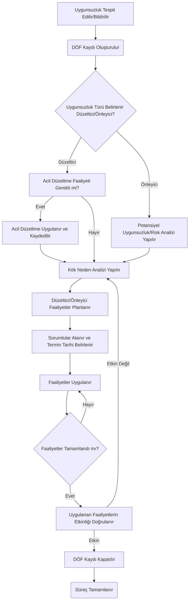
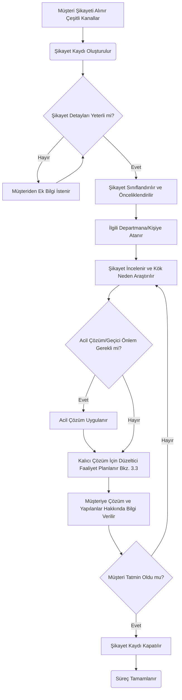
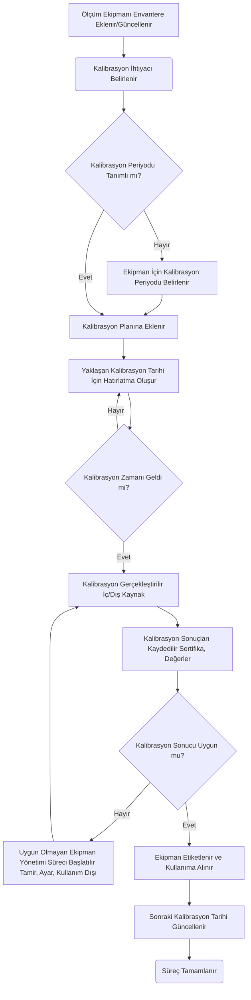
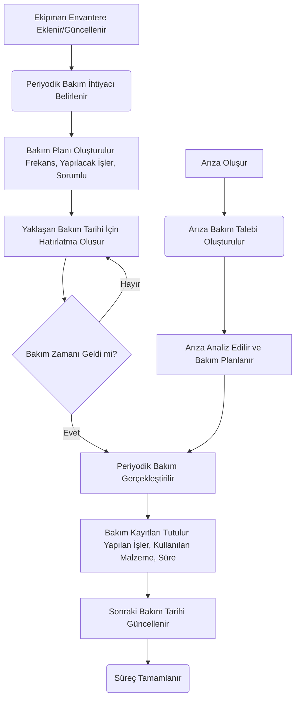
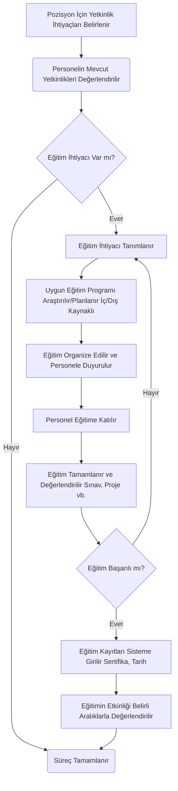
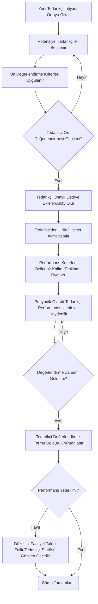
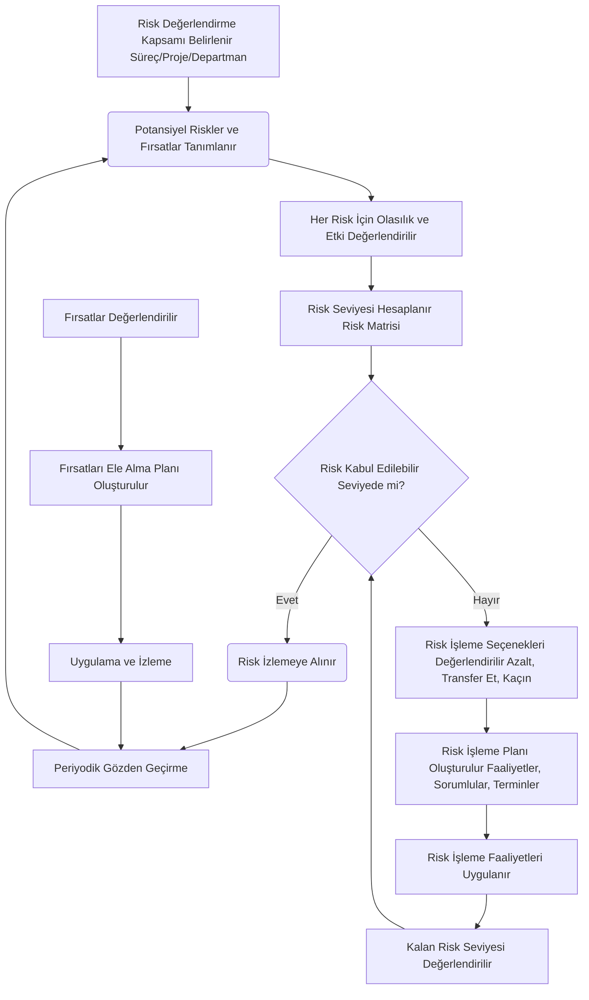
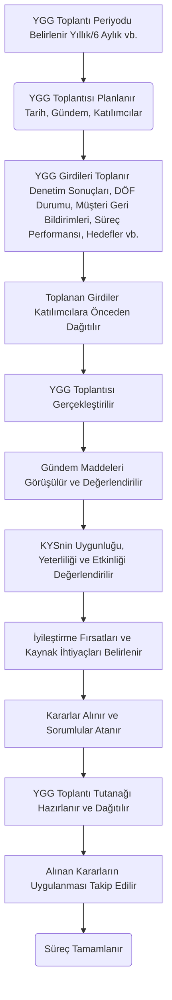

## Bölüm 3: Süreç Akış Diyagramları

Bu bölümde, Kalite Yönetim Sistemi (KYS) içerisindeki temel süreçlerin akış diyagramları metin tabanlı (Mermaid.js formatında) olarak sunulmuştur. Bu diyagramlar, süreç adımlarını, karar noktalarını ve farklı roller arasındaki etkileşimleri görselleştirmeyi amaçlar.

### 3.1. Giriş (Diyagramların Nasıl Okunacağına Dair Kısa Bir Rehber)

Mermaid.js formatındaki diyagramlar, metin tabanlı tanımlamalardan otomatik olarak akış şemaları oluşturur. Temel elemanlar şunlardır:
*   `graph TD` veya `graph LR`: Diyagramın yönünü belirtir (TD: Üstten Alta, LR: Soldan Sağa).
*   `A[Metin]`: Dikdörtgen bir süreç adımını temsil eder.
*   `B{Karar Metni}`: Baklava dilimi şeklinde bir karar noktasını temsil eder.
*   `C(Başlangıç/Bitiş)`: Yuvarlak köşeli dikdörtgen bir başlangıç veya bitiş noktasını temsil eder.
*   `-->`: İki adım arasındaki bağlantıyı gösterir.
*   `-- Metin -->`: Üzerinde açıklama olan bir bağlantıyı gösterir.

### 3.2. Doküman Oluşturma, Onay ve Yayınlama Süreci Diyagramı

```mermaid
graph TD
    A[Doküman İhtiyacı Belirlenir] --> B(Yeni Doküman Talebi Oluşturulur);
    B --> C{Doküman Türü Seçilir Prosedür/Talimat/Form vb.};
    C -- Prosedür/Talimat --> D[İlgili Departman Sorumlusu Taslak Hazırlar];
    C -- Form --> E[Form Tasarımı Yapılır];
    D --> F[Taslak Doküman Sisteme Yüklenir];
    E --> F;
    F --> G{Onay Akışı Başlatılır};
    G --> H[İlk Seviye Onaycı İnceler];
    H -- Onaylamaz --> I[Revizyon İçin Geri Gönderilir];
    I --> D;
    H -- Onaylar --> J[İkinci Seviye Onaycı (Kalite Yöneticisi) İnceler];
    J -- Onaylamaz --> I;
    J -- Onaylar --> K[Doküman Yayınlanır];
    K --> L[İlgili Personele Duyurulur/Dağıtılır];
    L --> M(Süreç Tamamlanır);
    M --> N[Periyodik Gözden Geçirme Tarihi Belirlenir];
```


### 3.3. DÖF Yönetimi Süreci Diyagramı (CAPA Management)



### 3.4. İç Denetim Süreci Diyagramı

```mermaid
graph TD
    A[Yıllık Denetim Programı Oluşturulur] --> B(Denetim Planı Hazırlanır Kapsam, Kriter, Ekip);
    B --> C[Denetim Soru Listeleri (Checklist) Hazırlanır/Seçilir];
    C --> D[Açılış Toplantısı Yapılır];
    D --> E[Denetim Gerçekleştirilir Saha İncelemesi, Görüşmeler, Kayıt Kontrolü];
    E --> F{Bulgu Tespit Edildi mi? Uygunsuzluk/Gözlem};
    F -- Evet --> G[Bulgular Kaydedilir ve Sınıflandırılır];
    G --> H[Kapanış Toplantısı Yapılır Bulgular Sunulur];
    F -- Hayır --> H;
    H --> I[Denetim Raporu Hazırlanır ve Dağıtılır];
    I --> J{Uygunsuzluk Var mı?};
    J -- Evet --> K[İlgili Uygunsuzluklar İçin DÖF Süreci Başlatılır Bkz. 3.3];
    K --> L[Takip Denetimi Planlanır Gerekirse];
    L --> M(Süreç Tamamlanır);
    J -- Hayır --> M;
```

### 3.5. Müşteri Şikayeti Ele Alma Süreci Diyagramı




### 3.6. Kalibrasyon Takip Süreci Diyagramı



### 3.7. Periyodik Bakım Süreci Diyagramı



### 3.8. Eğitim Yönetimi Süreci Diyagramı



### 3.9. Tedarikçi Değerlendirme Süreci Diyagramı



### 3.10. Risk Değerlendirme ve İşleme Süreci Diyagramı



### 3.11. Yönetimin Gözden Geçirmesi (YGG) Süreci Diyagramı



